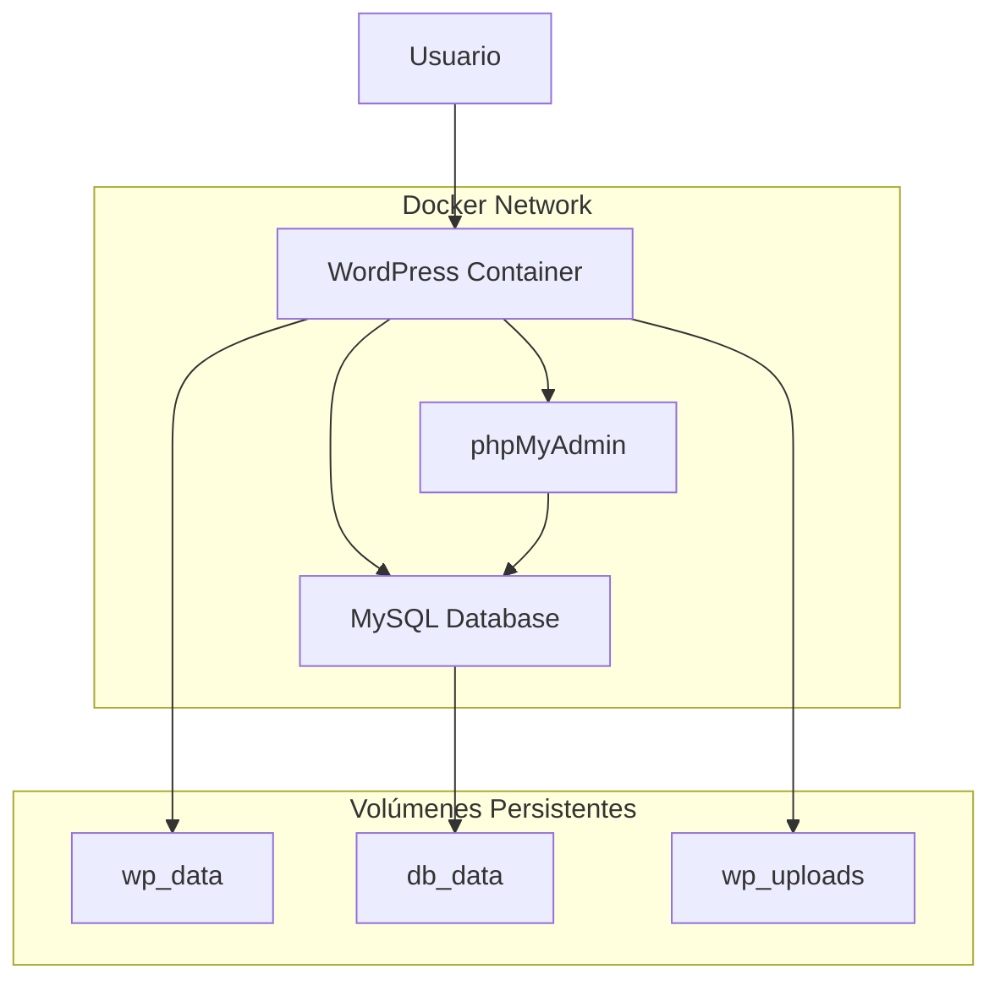
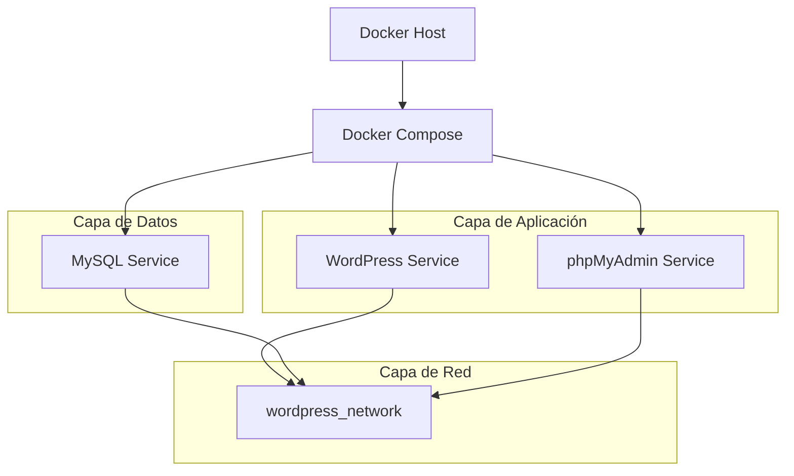
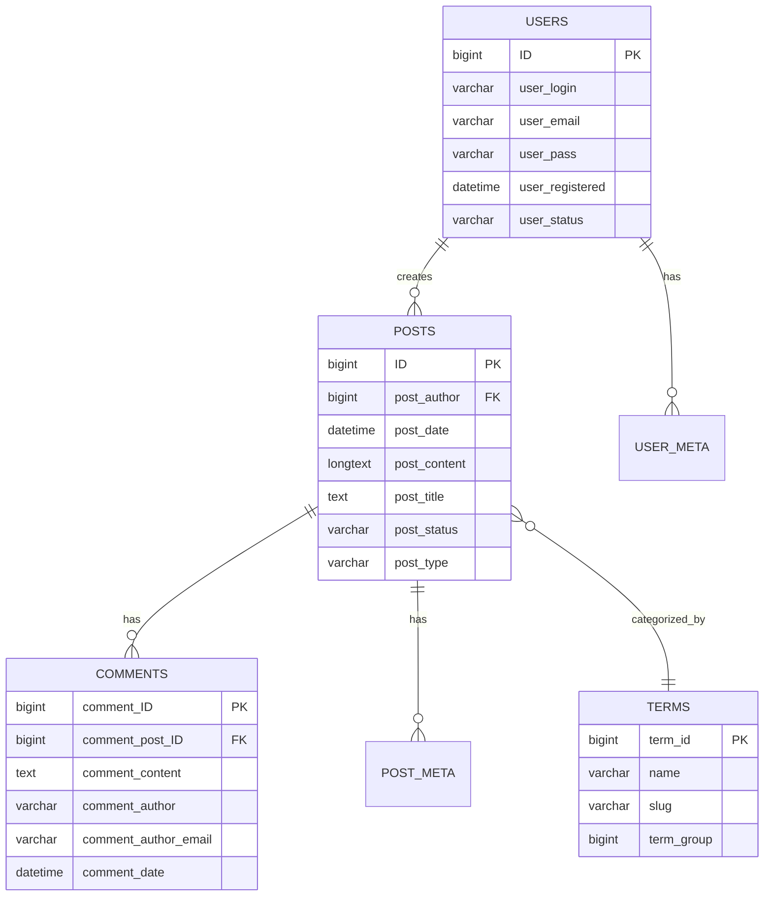

# Arquitectura Docker para WordPress

## 1. Arquitectura del Sistema



## 2. Descripción de Tecnologías

* **Frontend**: WordPress 6.4 (PHP 8.1 + Apache)

* **Base de Datos**: MySQL 8.0

* **Administración DB**: phpMyAdmin 5.2

* **Orquestación**: Docker Compose v2

* **Red**: Red interna Docker personalizada

* **Almacenamiento**: Volúmenes Docker persistentes

* **Acceso**: Directo a través de puertos expuestos

## 3. Definición de Rutas

| Ruta                    | Propósito                            |
| ----------------------- | ------------------------------------ |
| <http://localhost:8080> | Sitio WordPress principal            |
| <http://localhost:8081> | phpMyAdmin para administración de BD |
| /wp-admin               | Panel de administración WordPress    |
| /wp-content/uploads     | Archivos multimedia subidos          |

## 4. Definiciones de API

### 4.1 APIs Core de WordPress

**API REST de WordPress**

```
GET /wp-json/wp/v2/posts
```

Request:

| Parámetro | Tipo    | Requerido | Descripción                          |
| --------- | ------- | --------- | ------------------------------------ |
| per\_page | integer | false     | Número de posts por página (máx 100) |
| page      | integer | false     | Página a mostrar                     |
| search    | string  | false     | Término de búsqueda                  |

Response:

| Campo   | Tipo    | Descripción                            |
| ------- | ------- | -------------------------------------- |
| id      | integer | ID único del post                      |
| title   | object  | Título del post                        |
| content | object  | Contenido del post                     |
| status  | string  | Estado del post (publish, draft, etc.) |

Ejemplo:

```json
{
  "id": 1,
  "title": {
    "rendered": "Hola Mundo"
  },
  "content": {
    "rendered": "<p>Bienvenido a WordPress...</p>"
  },
  "status": "publish"
}
```

## 5. Arquitectura del Servidor



## 6. Modelo de Datos

### 6.1 Definición del Modelo de Datos



### 6.2 Lenguaje de Definición de Datos (DDL)

**Configuración de Base de Datos MySQL**

```sql
-- Crear base de datos
CREATE DATABASE wordpress_db CHARACTER SET utf8mb4 COLLATE utf8mb4_unicode_ci;

-- Crear usuario
CREATE USER 'wp_user'@'%' IDENTIFIED BY 'secure_password_123';
GRANT ALL PRIVILEGES ON wordpress_db.* TO 'wp_user'@'%';
FLUSH PRIVILEGES;

-- Configurar parámetros de rendimiento
SET GLOBAL innodb_buffer_pool_size = 256M;
SET GLOBAL max_connections = 100;
SET GLOBAL query_cache_size = 32M;

-- Índices recomendados para WordPress
CREATE INDEX idx_post_name ON wp_posts(post_name);
CREATE INDEX idx_post_parent ON wp_posts(post_parent);
CREATE INDEX idx_comment_approved_date_gmt ON wp_comments(comment_approved, comment_date_gmt);
```

**Configuración inicial de WordPress**

```sql
-- Datos iniciales de configuración
INSERT INTO wp_options (option_name, option_value) VALUES 
('siteurl', 'http://localhost:8080'),
('home', 'http://localhost:8080'),
('blogname', 'Mi Sitio WordPress'),
('admin_email', 'admin@midominio.com'),
('default_role', 'subscriber'),
('timezone_string', 'America/Lima');
```

