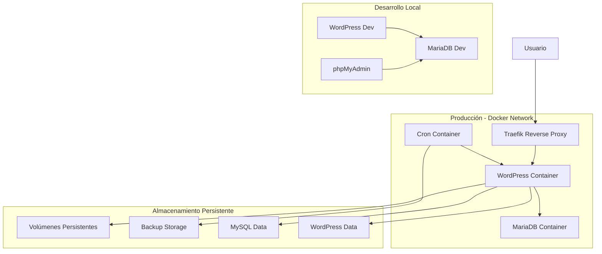
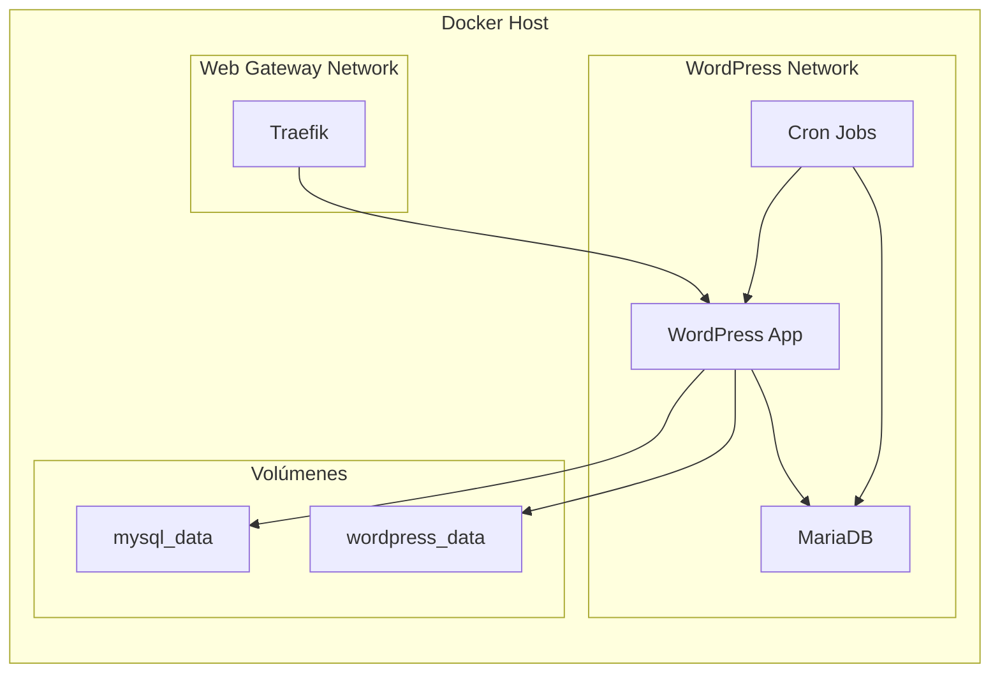

# Especificaciones Técnicas Completas - PAT01-ECOM

## 1. Información General del Proyecto

**Proyecto:** E-commerce WordPress con tema Organify  
**Código del Proyecto:** PAT01-ECOM  
**Entorno Local:** Ubuntu (WSL)  
**Entorno Producción:** Linux VPS con Traefik  
**Dominio Producción:** andessuyo.com  
**Servidor Producción:** 161.132.41.191  

### 1.1 Stack Tecnológico Principal

- **CMS:** WordPress 6.8.2
- **PHP:** 8.1 con Apache
- **Base de Datos:** MariaDB 10.11
- **E-commerce:** WooCommerce 10.2.2
- **Orquestación:** Docker Compose v2
- **Reverse Proxy:** Traefik (producción)
- **SSL:** Let's Encrypt automático
- **Idioma:** Español peruano (es_PE)

## 2. Arquitectura del Sistema

### 2.1 Diagrama de Arquitectura General



### 2.2 Arquitectura de Contenedores



## 3. Configuración de Infraestructura

### 3.1 Especificaciones de Contenedores

#### WordPress Container
```yaml
Imagen: wordpress:6.8.2-php8.1-apache
Nombre: wp_app (dev) / wp_app_prod (prod)
Puertos: 80 (interno)
Memoria: 512MB recomendado
CPU: 1 core mínimo
Healthcheck: curl wp-admin/install.php cada 30s
```

#### MariaDB Container
```yaml
Imagen: mariadb:10.11
Nombre: wp_mysql
Puerto: 3306 (interno)
Memoria: 256MB mínimo
Almacenamiento: Volumen persistente
Charset: utf8mb4_unicode_ci
Healthcheck: mysqladmin ping cada 20s
```

#### Cron Container (Solo Producción)
```yaml
Imagen: alpine:latest + dcron
Nombre: wp_cron
Funciones: Backup automático, mantenimiento
Volúmenes: Docker socket, directorio proyecto
```

### 3.2 Configuración de Red

#### Desarrollo
```yaml
Redes:
  - wordpress_network (bridge)
Puertos Expuestos:
  - WordPress: 9000
  - phpMyAdmin: 9001
```

#### Producción
```yaml
Redes:
  - wordpress_network (bridge, interna)
  - web_gateway (externa, Traefik)
SSL: Let's Encrypt automático
Dominio: andessuyo.com
```

### 3.3 Volúmenes Persistentes

```yaml
mysql_data:
  Driver: local
  Ubicación: /var/lib/docker/volumes/
  Propósito: Datos de MariaDB

wordpress_data:
  Driver: local
  Ubicación: /var/lib/docker/volumes/
  Propósito: Core WordPress

Bind Mounts:
  - ./wordpress/themes -> /var/www/html/wp-content/themes
  - ./wordpress/plugins -> /var/www/html/wp-content/plugins
  - ./wordpress/languages -> /var/www/html/wp-content/languages
```

## 4. Configuración de Servicios

### 4.1 Variables de Entorno

#### Desarrollo (.env)
```bash
# Base de Datos
MYSQL_ROOT_PASSWORD=root_password_secure_2024
MYSQL_DATABASE=wordpress_db
MYSQL_USER=wordpress_user
MYSQL_PASSWORD=wp_password_secure_2024

# WordPress
WORDPRESS_PORT=9000
WORDPRESS_URL=http://localhost:9000
WP_TABLE_PREFIX=wp_
WP_DEBUG=true

# phpMyAdmin
PHPMYADMIN_PORT=9001
```

#### Producción (.env)
```bash
# Base de Datos
MYSQL_ROOT_PASSWORD=[SECURE_PASSWORD]
MYSQL_DATABASE=wordpress_db
MYSQL_USER=wordpress_user
MYSQL_PASSWORD=[SECURE_PASSWORD]

# WordPress
WORDPRESS_URL=https://andessuyo.com
WP_TABLE_PREFIX=wp_a4b7_
WP_DEBUG=false

# Configuraciones de Seguridad
DISALLOW_FILE_EDIT=true
DISALLOW_FILE_MODS=false
WP_CACHE=true
WP_POST_REVISIONS=3
AUTOSAVE_INTERVAL=300
```

### 4.2 Configuración PHP

```ini
memory_limit = 256M
max_execution_time = 300
max_input_vars = 3000
upload_max_filesize = 100M
post_max_size = 100M
max_file_uploads = 20
```

### 4.3 Configuración MariaDB

```sql
-- Configuraciones de rendimiento
innodb_buffer_pool_size = 256M
max_connections = 100
query_cache_size = 32M
character_set_server = utf8mb4
collation_server = utf8mb4_unicode_ci
```

## 5. Estructura de Temas y Plugins

### 5.1 Tema Principal y Hijo

```
wordpress/themes/
├── organify/                    # TEMA PADRE (NO MODIFICAR)
│   ├── style.css
│   ├── functions.php
│   ├── assets/
│   └── templates/
└── organify-child/              # TEMA HIJO (TODAS LAS MODIFICACIONES)
    ├── style.css               # Header obligatorio + estilos custom
    ├── functions.php           # Funciones personalizadas
    ├── screenshot.png          # Captura del tema
    └── templates/              # Templates personalizados
```

#### Estructura functions.php del Tema Hijo
```php
<?php
// Prevenir acceso directo
if (!defined('ABSPATH')) exit;

// Cargar estilos del tema padre
add_action('wp_enqueue_scripts', 'organify_child_enqueue_styles');

// Configurar textdomain
add_action('after_setup_theme', 'organify_child_setup');

// Función de respaldo para pxl_register_shortcode
if (!function_exists('pxl_register_shortcode')) {
    function pxl_register_shortcode($tag, $callback) {
        add_shortcode($tag, $callback);
    }
}

// Soporte para biblioteca de medios
add_action('admin_enqueue_scripts', 'organify_child_admin_scripts');
add_action('after_setup_theme', 'organify_child_media_support');
```

### 5.2 Plugins Instalados y Configurados

#### Core E-commerce
- **WooCommerce 10.2.2**: Funcionalidad e-commerce principal
- **Woo Smart Compare**: Comparación de productos
- **Woo Smart Quick View**: Vista rápida de productos
- **Woo Smart Wishlist**: Lista de deseos

#### Page Builder y Diseño
- **Elementor**: Constructor de páginas visual
- **Case Addons**: Elementos adicionales para Elementor
- **RevSlider**: Slider avanzado

#### Funcionalidad
- **Contact Form 7**: Formularios de contacto
- **Easy Login WooCommerce**: Login social
- **MailChimp for WP**: Newsletter y email marketing
- **Redux Framework**: Panel de opciones del tema

#### Seguridad y Mantenimiento
- **Wordfence**: Firewall y seguridad
- **Akismet**: Anti-spam para comentarios

#### Utilidades
- **Customizer Export Import**: Exportar/importar configuraciones

## 6. Base de Datos

### 6.1 Estructura de Tablas WordPress Core

```sql
-- Tablas principales de WordPress
wp_posts              # Contenido (posts, páginas, productos)
wp_postmeta           # Metadatos de contenido
wp_users              # Usuarios del sistema
wp_usermeta           # Metadatos de usuarios
wp_comments           # Comentarios
wp_commentmeta        # Metadatos de comentarios
wp_terms              # Términos (categorías, tags)
wp_term_taxonomy      # Taxonomías
wp_term_relationships # Relaciones término-objeto
wp_options            # Configuraciones del sitio
```

### 6.2 Tablas WooCommerce

```sql
-- Tablas específicas de WooCommerce
wp_woocommerce_order_items       # Items de pedidos
wp_woocommerce_order_itemmeta    # Metadatos de items
wp_woocommerce_tax_rates         # Tasas de impuestos
wp_woocommerce_tax_rate_locations # Ubicaciones de impuestos
wp_woocommerce_shipping_zones    # Zonas de envío
wp_woocommerce_shipping_zone_locations # Ubicaciones de envío
wp_woocommerce_shipping_zone_methods   # Métodos de envío
wp_woocommerce_payment_tokens    # Tokens de pago
wp_woocommerce_log               # Logs del sistema
```

### 6.3 Configuración de Índices Optimizados

```sql
-- Índices recomendados para rendimiento
CREATE INDEX idx_post_name ON wp_posts(post_name);
CREATE INDEX idx_post_parent ON wp_posts(post_parent);
CREATE INDEX idx_post_type_status ON wp_posts(post_type, post_status);
CREATE INDEX idx_comment_approved_date ON wp_comments(comment_approved, comment_date_gmt);
CREATE INDEX idx_meta_key_value ON wp_postmeta(meta_key, meta_value(10));
CREATE INDEX idx_user_login ON wp_users(user_login);
```

## 7. APIs y Endpoints

### 7.1 WordPress REST API

#### Posts y Páginas
```
GET /wp-json/wp/v2/posts
GET /wp-json/wp/v2/pages
POST /wp-json/wp/v2/posts
PUT /wp-json/wp/v2/posts/{id}
DELETE /wp-json/wp/v2/posts/{id}
```

#### Usuarios
```
GET /wp-json/wp/v2/users
POST /wp-json/wp/v2/users
GET /wp-json/wp/v2/users/me
```

#### Medios
```
GET /wp-json/wp/v2/media
POST /wp-json/wp/v2/media
```

### 7.2 WooCommerce REST API

#### Productos
```
GET /wp-json/wc/v3/products
POST /wp-json/wc/v3/products
GET /wp-json/wc/v3/products/{id}
PUT /wp-json/wc/v3/products/{id}
DELETE /wp-json/wc/v3/products/{id}
```

#### Pedidos
```
GET /wp-json/wc/v3/orders
POST /wp-json/wc/v3/orders
GET /wp-json/wc/v3/orders/{id}
PUT /wp-json/wc/v3/orders/{id}
```

#### Clientes
```
GET /wp-json/wc/v3/customers
POST /wp-json/wc/v3/customers
GET /wp-json/wc/v3/customers/{id}
```

#### Categorías de Productos
```
GET /wp-json/wc/v3/products/categories
POST /wp-json/wc/v3/products/categories
```

### 7.3 Autenticación API

```php
// Autenticación básica
Authorization: Basic base64(username:password)

// JWT Token (con plugin)
Authorization: Bearer {jwt_token}

// OAuth 1.0a (WooCommerce)
oauth_consumer_key={key}&oauth_signature={signature}
```

## 8. Seguridad y Backup

### 8.1 Configuraciones de Seguridad

#### WordPress Security Headers
```php
// wp-config.php security settings
define('DISALLOW_FILE_EDIT', true);
define('DISALLOW_FILE_MODS', true);
define('FORCE_SSL_ADMIN', true);
define('WP_AUTO_UPDATE_CORE', true);

// Security keys (auto-generated)
define('AUTH_KEY', 'random-string');
define('SECURE_AUTH_KEY', 'random-string');
define('LOGGED_IN_KEY', 'random-string');
define('NONCE_KEY', 'random-string');
```

#### Wordfence Configuration
```
- Firewall activado
- Malware scan diario
- Login security habilitado
- Rate limiting configurado
- Country blocking (opcional)
- Two-factor authentication disponible
```

#### Permisos de Archivos
```bash
# Directorios: 755
find /var/www/html -type d -exec chmod 755 {} \;

# Archivos: 644
find /var/www/html -type f -exec chmod 644 {} \;

# wp-config.php: 600
chmod 600 wp-config.php
```

### 8.2 Sistema de Backup Automático

#### Configuración Cron
```bash
# Backup diario a las 2:00 AM
0 2 * * * /usr/local/bin/backup.sh
```

#### Script de Backup (backup.sh)
```bash
#!/bin/bash
# Backup de base de datos
docker exec wp_mysql mysqldump -u root -p${MYSQL_ROOT_PASSWORD} wordpress_db > backup_$(date +%Y%m%d).sql

# Backup de archivos WordPress
docker exec wp_app tar -czf /tmp/wordpress_backup_$(date +%Y%m%d).tar.gz /var/www/html/wp-content

# Retención de 30 días
find /backups -name "*.sql" -mtime +30 -delete
find /backups -name "*.tar.gz" -mtime +30 -delete
```

#### Restauración de Backup
```bash
# Restaurar base de datos
docker exec -i wp_mysql mysql -u root -p${MYSQL_ROOT_PASSWORD} wordpress_db < backup_20241215.sql

# Restaurar archivos
docker exec wp_app tar -xzf /tmp/wordpress_backup_20241215.tar.gz -C /
```

## 9. Procedimientos de Deploy

### 9.1 Deploy de Desarrollo

```bash
# 1. Clonar repositorio
git clone [repository-url] PAT01-ECOM
cd PAT01-ECOM

# 2. Configurar variables de entorno
cp .env.example .env
# Editar .env con configuraciones locales

# 3. Levantar servicios
docker-compose -f docker-compose.dev.yml up -d

# 4. Verificar servicios
docker-compose -f docker-compose.dev.yml ps
docker-compose -f docker-compose.dev.yml logs -f

# 5. Acceder a la aplicación
# WordPress: http://localhost:9000
# phpMyAdmin: http://localhost:9001
```

### 9.2 Deploy de Producción

```bash
# En el servidor de producción (161.132.41.191)
ssh root@161.132.41.191

# 1. Navegar al directorio del proyecto
cd /opt/PAT01-ECOM

# 2. Actualizar código
git pull origin main

# 3. Verificar variables de entorno
cat .env

# 4. Rebuild y restart servicios
docker-compose -f docker-compose.prod.yml down
docker-compose -f docker-compose.prod.yml up -d --build

# 5. Verificar servicios
docker ps
docker-compose -f docker-compose.prod.yml logs -f wordpress

# 6. Verificar conectividad
curl -I https://andessuyo.com
```

### 9.3 Rollback de Producción

```bash
# 1. Identificar commit anterior
git log --oneline -5

# 2. Rollback a commit específico
git reset --hard [commit-hash]

# 3. Rebuild servicios
docker-compose -f docker-compose.prod.yml down
docker-compose -f docker-compose.prod.yml up -d --build

# 4. Verificar funcionamiento
curl -I https://andessuyo.com
```

## 10. Monitoreo y Logs

### 10.1 Logs de Aplicación

#### WordPress Logs
```bash
# Logs del contenedor WordPress
docker logs wp_app -f

# Logs de PHP errors
docker exec wp_app tail -f /var/log/apache2/error.log

# WordPress debug log
docker exec wp_app tail -f /var/www/html/wp-content/debug.log
```

#### MariaDB Logs
```bash
# Logs de MariaDB
docker logs wp_mysql -f

# Error log de MySQL
docker exec wp_mysql tail -f /var/log/mysql/error.log

# Slow query log
docker exec wp_mysql tail -f /var/log/mysql/slow.log
```

#### Traefik Logs (Producción)
```bash
# Logs de Traefik
docker logs traefik -f

# Access logs
tail -f /var/log/traefik/access.log
```

### 10.2 Métricas de Rendimiento

#### Monitoreo de Recursos
```bash
# Uso de CPU y memoria por contenedor
docker stats

# Espacio en disco
df -h

# Uso de volúmenes Docker
docker system df
```

#### Métricas de WordPress
```bash
# Queries de base de datos lentas
docker exec wp_mysql mysql -u root -p${MYSQL_ROOT_PASSWORD} -e "SHOW PROCESSLIST;"

# Tamaño de base de datos
docker exec wp_mysql mysql -u root -p${MYSQL_ROOT_PASSWORD} -e "SELECT table_schema AS 'Database', ROUND(SUM(data_length + index_length) / 1024 / 1024, 2) AS 'Size (MB)' FROM information_schema.tables GROUP BY table_schema;"
```

### 10.3 Health Checks

#### WordPress Health Check
```bash
# Verificar estado de WordPress
curl -f http://localhost/wp-admin/install.php

# Verificar API REST
curl -f http://localhost/wp-json/wp/v2/posts
```

#### Database Health Check
```bash
# Verificar conexión a MariaDB
docker exec wp_mysql mysqladmin ping -h localhost -u root -p${MYSQL_ROOT_PASSWORD}
```

## 11. Troubleshooting Común

### 11.1 Problemas de Contenedores

#### WordPress no inicia
```bash
# Verificar logs
docker logs wp_app

# Verificar variables de entorno
docker exec wp_app env | grep WORDPRESS

# Verificar conexión a base de datos
docker exec wp_app wp db check --allow-root
```

#### MariaDB no inicia
```bash
# Verificar logs
docker logs wp_mysql

# Verificar volumen de datos
docker volume inspect pat01-ecom_mysql_data

# Reparar base de datos
docker exec wp_mysql mysqlcheck -u root -p${MYSQL_ROOT_PASSWORD} --auto-repair --all-databases
```

### 11.2 Problemas de Rendimiento

#### WordPress lento
```bash
# Verificar plugins activos
docker exec wp_app wp plugin list --allow-root

# Verificar queries lentas
docker exec wp_app wp db query "SHOW PROCESSLIST;" --allow-root

# Limpiar cache
docker exec wp_app wp cache flush --allow-root
```

#### Base de datos lenta
```bash
# Optimizar tablas
docker exec wp_mysql mysqlcheck -u root -p${MYSQL_ROOT_PASSWORD} --optimize wordpress_db

# Verificar índices
docker exec wp_mysql mysql -u root -p${MYSQL_ROOT_PASSWORD} -e "SHOW INDEX FROM wordpress_db.wp_posts;"
```

### 11.3 Problemas de SSL/Certificados

#### Certificado SSL no se renueva
```bash
# Verificar logs de Traefik
docker logs traefik | grep letsencrypt

# Forzar renovación
docker exec traefik traefik --certificatesresolvers.letsencrypt.acme.email=admin@andessuyo.com
```

### 11.4 Problemas de Permisos

#### Archivos no se pueden subir
```bash
# Verificar permisos de wp-content
docker exec wp_app ls -la /var/www/html/wp-content/

# Corregir permisos
docker exec wp_app chown -R www-data:www-data /var/www/html/wp-content/
docker exec wp_app chmod -R 755 /var/www/html/wp-content/
```

## 12. Mejores Prácticas

### 12.1 Desarrollo

1. **Nunca modificar el tema padre** - Usar siempre el tema hijo
2. **Usar variables de entorno** - No hardcodear credenciales
3. **Validar sintaxis PHP** - Antes de aplicar cambios
4. **Documentar cambios** - Comentarios claros en el código
5. **Probar en desarrollo** - Antes de deploy a producción

### 12.2 Seguridad

1. **Actualizar regularmente** - WordPress, plugins y temas
2. **Usar contraseñas fuertes** - Para todos los usuarios
3. **Limitar intentos de login** - Configurar Wordfence
4. **Backup regular** - Automático y verificado
5. **Monitorear logs** - Revisar actividad sospechosa

### 12.3 Rendimiento

1. **Optimizar imágenes** - Comprimir antes de subir
2. **Usar cache** - Configurar cache de WordPress
3. **Minimizar plugins** - Solo los necesarios
4. **Optimizar base de datos** - Limpiar regularmente
5. **CDN** - Para contenido estático (futuro)

### 12.4 Mantenimiento

1. **Backup antes de cambios** - Siempre
2. **Monitorear recursos** - CPU, memoria, disco
3. **Limpiar logs antiguos** - Evitar llenar disco
4. **Revisar actualizaciones** - Semanalmente
5. **Documentar cambios** - Mantener registro

## 13. Comandos de Referencia Rápida

### 13.1 Docker Compose

```bash
# Desarrollo
docker-compose -f docker-compose.dev.yml up -d
docker-compose -f docker-compose.dev.yml down
docker-compose -f docker-compose.dev.yml logs -f

# Producción
docker-compose -f docker-compose.prod.yml up -d --build
docker-compose -f docker-compose.prod.yml down
docker-compose -f docker-compose.prod.yml logs wordpress
```

### 13.2 WordPress CLI

```bash
# Información del sitio
docker exec wp_app wp core version --allow-root
docker exec wp_app wp plugin list --allow-root
docker exec wp_app wp theme list --allow-root

# Base de datos
docker exec wp_app wp db check --allow-root
docker exec wp_app wp db optimize --allow-root

# Cache
docker exec wp_app wp cache flush --allow-root
```

### 13.3 Git

```bash
# Estado del repositorio
git status
git log --oneline -5

# Commits
git add .
git commit -m "feat: descripción del cambio"
git push origin main

# Deploy
git pull origin main
```

---

**Documento generado:** $(date)  
**Versión:** 1.0  
**Proyecto:** PAT01-ECOM  
**Autor:** Equipo de Desarrollo