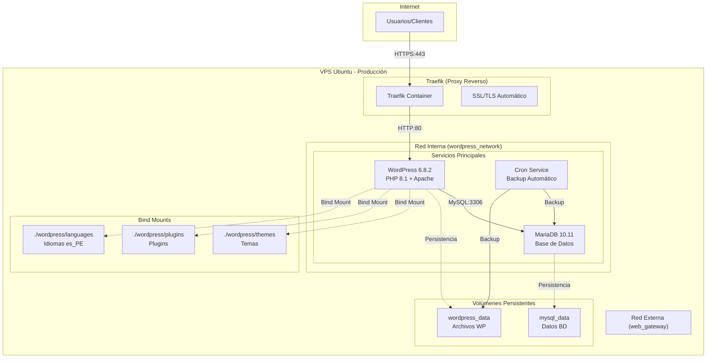
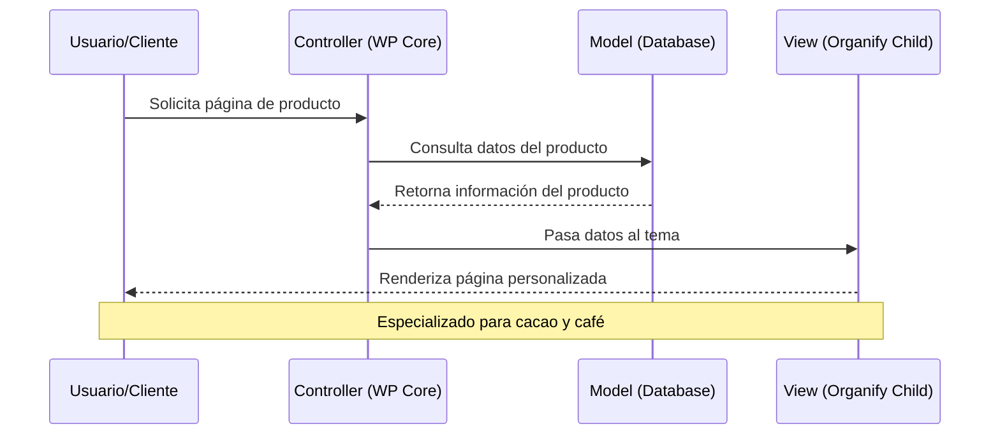

# Guía Técnica Completa - Configuración Docker Compose PAT01-ECOM

## Índice

### 1. [Introducción y Arquitectura General](#1-introducción-y-arquitectura-general)
   - 1.1 [Descripción del Proyecto](#11-descripción-del-proyecto)
   - 1.2 [Objetivos y Alcance](#12-objetivos-y-alcance)
   - 1.3 [Arquitectura General del Sistema](#13-arquitectura-general-del-sistema)

### 2. [Justificación de la Arquitectura Dockerizada](#2-justificación-de-la-arquitectura-dockerizada)
   - 2.1 [Ventajas de Docker vs LAMP Tradicional](#21-ventajas-de-docker-vs-lamp-tradicional)
   - 2.2 [Beneficios Específicos para PAT01-ECOM](#22-beneficios-específicos-para-pat01-ecom)
   - 2.3 [Escalabilidad y Mantenimiento](#23-escalabilidad-y-mantenimiento)

### 3. [Resumen de Contenedores, Redes y Volúmenes](#3-resumen-de-contenedores-redes-y-volúmenes)
   - 3.1 [Arquitectura de Contenedores](#31-arquitectura-de-contenedores)
   - 3.2 [Configuración de Redes](#32-configuración-de-redes)
   - 3.3 [Gestión de Volúmenes](#33-gestión-de-volúmenes)

### 4. [Estructura de Carpetas en Producción](#4-estructura-de-carpetas-en-producción)
   - 4.1 [Mapeo de Directorios](#41-mapeo-de-directorios)
   - 4.2 [Archivos Desplegados vs Excluidos](#42-archivos-desplegados-vs-excluidos)
   - 4.3 [Flujo de Trabajo Git → Producción](#43-flujo-de-trabajo-git--producción)

### 5. [Guía de Instalación en VPS Ubuntu](#5-guía-de-instalación-en-vps-ubuntu)
   - 5.1 [Preparación del Servidor](#51-preparación-del-servidor)
   - 5.2 [Instalación de Docker y Docker Compose](#52-instalación-de-docker-y-docker-compose)
   - 5.3 [Clonación y Configuración del Proyecto](#53-clonación-y-configuración-del-proyecto)
   - 5.4 [Despliegue y Verificación](#54-despliegue-y-verificación)

### 6. [Arquitectura Interna de WordPress](#6-arquitectura-interna-de-wordpress)
   - 6.1 [Estructura MVC de WordPress](#61-estructura-mvc-de-wordpress)
   - 6.2 [Sistema de Temas y Plugins](#62-sistema-de-temas-y-plugins)
   - 6.3 [Gestión de Contenido y Base de Datos](#63-gestión-de-contenido-y-base-de-datos)

### 7. [Componentes Desarrollados (Tema Organify)](#7-componentes-desarrollados-tema-organify)
   - 7.1 [Tema Padre Organify](#71-tema-padre-organify)
   - 7.2 [Tema Hijo Personalizado](#72-tema-hijo-personalizado)
   - 7.3 [Funcionalidades Desarrolladas](#73-funcionalidades-desarrolladas)

### 8. [Elementos No-Code (Elementor)](#8-elementos-no-code-elementor)
   - 8.1 [Configuraciones de Elementor](#81-configuraciones-de-elementor)
   - 8.2 [Diferenciación: Código vs Configuración](#82-diferenciación-código-vs-configuración)
   - 8.3 [Plugins y Extensiones](#83-plugins-y-extensiones)

### 9. [Configuración Detallada de Servicios](#9-configuración-detallada-de-servicios)
   - 9.1 [Servicio MySQL (MariaDB 10.11)](#91-servicio-mysql-mariadb-1011)
   - 9.2 [Servicio WordPress de Producción](#92-servicio-wordpress-de-producción)
   - 9.3 [Servicio Cron para Backup Automatizado](#93-servicio-cron-para-backup-automatizado)
   - 9.4 [Configuración de Traefik y SSL Automático](#94-configuración-de-traefik-y-ssl-automático)

### 10. [Mantenimiento y Troubleshooting](#10-mantenimiento-y-troubleshooting)
   - 10.1 [Monitoreo del Sistema](#101-monitoreo-del-sistema)
   - 10.2 [Problemas Comunes y Soluciones](#102-problemas-comunes-y-soluciones)
   - 10.3 [Procedimientos de Backup y Restauración](#103-procedimientos-de-backup-y-restauración)
   - 10.4 [Actualizaciones y Mantenimiento](#104-actualizaciones-y-mantenimiento)

---

## 1. Introducción y Arquitectura General

### 1.1 Descripción del Proyecto

Este documento constituye la guía técnica completa para la configuración Docker Compose del proyecto PAT01-ECOM de **PACIFIC ALLIANCE TRADING COMPANY SAC**. El proyecto implementa un e-commerce especializado en la comercialización de **cacao de Paimas** y **granos de café de Huancabamba**, productos agrícolas de alta calidad originarios de la región Piura, Perú.

La solución está específicamente diseñada para operar durante **4 años** con un presupuesto total de **S/16,000** (incluido IGV), proporcionando soporte para **usuarios ilimitados** y garantizando alta disponibilidad para las operaciones comerciales de la empresa.

### 1.2 Objetivos y Alcance

**Objetivos Principales:**
- Implementar un e-commerce robusto y escalable para productos agrícolas especializados
- Garantizar operación continua 24/7 durante 4 años de hosting
- Optimizar costos operativos dentro del presupuesto establecido
- Proporcionar una plataforma segura para transacciones financieras
- Facilitar la gestión de inventario y catálogo de productos agrícolas

**Alcance Técnico:**
- Arquitectura containerizada con Docker Compose
- WordPress 6.8.2 con PHP 8.1 como plataforma base
- WooCommerce para funcionalidades e-commerce
- MariaDB 10.11 como sistema de base de datos
- Traefik para proxy reverso y SSL automático
- Sistema de backup automatizado con Cron
- Tema personalizado Organify para productos orgánicos

### 1.3 Arquitectura General del Sistema



Esta arquitectura proporciona una base sólida para el e-commerce de PACIFIC ALLIANCE TRADING COMPANY SAC, combinando la flexibilidad de contenedores Docker con la robustez de WordPress/WooCommerce para crear una plataforma de venta especializada en productos agrícolas de alta calidad.

---

### 2.1 Ventajas de Docker vs LAMP Tradicional

La elección de Docker sobre una instalación LAMP tradicional para PAT01-ECOM se fundamenta en ventajas técnicas y económicas específicas:

**Comparación Técnica:**

| Aspecto | LAMP Tradicional | Docker Compose |
|---------|------------------|----------------|
| **Instalación** | Configuración manual compleja | Automatizada con archivos YAML |
| **Portabilidad** | Dependiente del servidor | Funciona en cualquier host Docker |
| **Aislamiento** | Servicios compartidos | Contenedores aislados |
| **Escalabilidad** | Reconfiguración manual | Escalado horizontal automático |
| **Backup** | Scripts personalizados | Volúmenes y contenedores |
| **Actualizaciones** | Riesgo de incompatibilidades | Versionado de imágenes |
| **Rollback** | Complejo y riesgoso | Instantáneo con imágenes |
| **Costo Operativo** | Alto mantenimiento manual | Automatización reducida |

### 2.2 Beneficios Específicos para PAT01-ECOM

**Para el Presupuesto de S/16,000:**
- **Reducción de costos operativos:** Automatización de tareas de mantenimiento
- **Menor tiempo de inactividad:** Despliegues sin interrupciones
- **Escalabilidad económica:** Crecimiento sin reconfiguración completa
- **Backup automatizado:** Protección de datos sin intervención manual

**Para Productos Agrícolas Especializados:**
- **Alta disponibilidad:** Crítica para ventas de productos perecederos
- **Gestión de inventario:** Actualizaciones en tiempo real sin interrupciones
- **Seguridad transaccional:** Aislamiento de servicios financieros
- **Multiidioma:** Soporte nativo para español peruano (es_PE)

### 2.3 Escalabilidad y Mantenimiento

**Escalabilidad Horizontal:**
```yaml
# Escalado futuro sin reconfiguración
services:
  wordpress:
    deploy:
      replicas: 3  # Múltiples instancias
      resources:
        limits:
          memory: 512M
        reservations:
          memory: 256M
```

**Mantenimiento Predictivo:**
- **Health checks automáticos:** Detección temprana de problemas
- **Logs centralizados:** Monitoreo proactivo del sistema
- **Actualizaciones controladas:** Versionado de imágenes Docker
- **Rollback instantáneo:** Recuperación rápida ante fallos

---

## 3. Resumen de Contenedores, Redes y Volúmenes

### 3.1 Arquitectura de Contenedores

**Servicios Principales:**

```yaml
# Contenedor 1: Base de Datos
mysql:
  image: mariadb:10.11
  container_name: wp_mysql
  # Función: Almacenamiento de datos críticos del e-commerce
  # Recursos: Optimizado para transacciones WooCommerce
  # Seguridad: Red interna, sin exposición externa

# Contenedor 2: Aplicación Web
wordpress:
  image: wordpress:6.8.2-php8.1-apache
  container_name: wp_app_prod
  # Función: Plataforma e-commerce principal
  # Recursos: PHP 8.1 optimizado para WooCommerce
  # Seguridad: Acceso controlado vía Traefik

# Contenedor 3: Backup Automatizado
cron:
  build: ./cron.Dockerfile
  container_name: wp_cron
  # Función: Backup automático de datos y archivos
  # Recursos: Acceso a Docker daemon para gestión
  # Seguridad: Red interna, sin acceso externo
```

**Distribución de Recursos:**
- **MySQL:** 40% recursos (crítico para transacciones)
- **WordPress:** 50% recursos (interfaz principal)
- **Cron:** 10% recursos (tareas programadas)

### 3.2 Configuración de Redes

**Red Interna (wordpress_network):**
```yaml
networks:
  wordpress_network:
    driver: bridge
    ipam:
      config:
        - subnet: 172.20.0.0/16
```
- **Propósito:** Comunicación segura entre servicios internos
- **Servicios:** MySQL, WordPress, Cron
- **Seguridad:** Aislada de internet, sin puertos expuestos

**Red Externa (web_gateway):**
```yaml
networks:
  web_gateway:
    external: true
```
- **Propósito:** Acceso público controlado vía Traefik
- **Servicios:** Solo WordPress (puerto 80 interno)
- **Seguridad:** SSL/TLS automático, certificados Let's Encrypt

### 3.3 Gestión de Volúmenes

**Volúmenes Persistentes:**

```yaml
volumes:
  # Datos críticos de la base de datos
  mysql_data:
    driver: local
    # Contiene: Productos, pedidos, clientes, configuraciones
    # Backup: Diario automático vía Cron
    # Ubicación: /var/lib/docker/volumes/

  # Archivos de WordPress
  wordpress_data:
    driver: local
    # Contiene: Uploads, cache, configuraciones dinámicas
    # Backup: Diario automático vía Cron
    # Ubicación: /var/lib/docker/volumes/
```

**Bind Mounts (Desarrollo):**
```yaml
volumes:
  # Temas personalizados
  - ./wordpress/themes:/var/www/html/wp-content/themes
  # Plugins específicos
  - ./wordpress/plugins:/var/www/html/wp-content/plugins
  # Idioma español peruano
  - ./wordpress/languages:/var/www/html/wp-content/languages
```

---

## 4. Estructura de Carpetas en Producción

### 4.1 Mapeo de Directorios

**Estructura del Repositorio:**
```
PAT01-ECOM/
├── 📁 .trae/                          # Documentación y reglas
│   ├── documents/                     # ✅ INCLUIDO: Documentación técnica
│   └── rules/                         # ✅ INCLUIDO: Reglas del proyecto
├── 📁 wordpress/                      # ✅ INCLUIDO: Código personalizado
│   ├── themes/
│   │   ├── organify/                  # ❌ EXCLUIDO: Tema comercial
│   │   └── organify-child/            # ✅ INCLUIDO: Personalizaciones
│   ├── plugins/                       # ✅ INCLUIDO: Plugins específicos
│   └── languages/                     # ✅ INCLUIDO: Español peruano
├── 📁 docker/                         # ✅ INCLUIDO: Scripts Docker
├── 📁 mysql/                          # ✅ INCLUIDO: Inicialización BD
├── 📄 docker-compose.prod.yml         # ✅ INCLUIDO: Configuración producción
├── 📄 docker-compose.dev.yml          # ✅ INCLUIDO: Configuración desarrollo
├── 📄 cron.Dockerfile                 # ✅ INCLUIDO: Backup automatizado
├── 📄 backup.sh                       # ✅ INCLUIDO: Script de backup
├── 📄 .env.example                    # ✅ INCLUIDO: Plantilla variables
└── 📁 backups/                        # ❌ EXCLUIDO: Backups locales
```

### 4.2 Archivos Desplegados vs Excluidos

**Según project_rules.md:**

**✅ SIEMPRE INCLUIR EN PRODUCCIÓN:**
```bash
# Configuraciones Docker
docker-compose.prod.yml
docker-compose.dev.yml
cron.Dockerfile
backup.sh

# Código personalizado
wordpress/themes/organify-child/
wordpress/plugins/
wordpress/languages/

# Documentación
.trae/documents/
.trae/rules/
README.md
```

**❌ NUNCA INCLUIR EN PRODUCCIÓN:**
```bash
# Datos sensibles
.env                    # Variables de entorno reales
wp-config.php          # Configuración WordPress

# Backups locales
backups/               # Copias de seguridad locales
*.sql                  # Dumps de base de datos

# Archivos temporales
.DS_Store              # macOS
Thumbs.db             # Windows
*.log                 # Logs locales
```

### 4.3 Flujo de Trabajo Git → Producción

**Proceso Completo de Deploy:**

```bash
# 1. DESARROLLO LOCAL (Ubuntu/WSL)
cd /home/chris/PAT01-ECOM
git status
git add wordpress/themes/organify-child/
git commit -m "feat: nueva funcionalidad para productos agrícolas"
git push origin main

# 2. SERVIDOR DE PRODUCCIÓN (VPS Ubuntu)
ssh root@161.132.41.191
cd /opt/PAT01-ECOM
git pull origin main

# 3. APLICAR CAMBIOS SIN INTERRUPCIONES
docker-compose -f docker-compose.prod.yml down
docker-compose -f docker-compose.prod.yml up -d --build

# 4. VERIFICACIÓN POST-DEPLOY
docker ps
docker-compose -f docker-compose.prod.yml logs -f wordpress
curl -I https://andessuyo.com
```

**Validaciones Automáticas:**
- ✅ Sintaxis PHP antes del commit
- ✅ Health checks post-deploy
- ✅ Verificación SSL/HTTPS
- ✅ Conectividad base de datos
- ✅ Funcionalidad WooCommerce

---

## 5. Guía de Instalación en VPS Ubuntu

### 5.1 Preparación del Servidor

**Especificaciones Mínimas del VPS:**
- **OS:** Ubuntu 20.04 LTS o superior
- **RAM:** 2GB mínimo (4GB recomendado)
- **Almacenamiento:** 20GB SSD mínimo
- **CPU:** 2 vCores mínimo
- **Ancho de banda:** Ilimitado

**Configuración Inicial del Servidor:**

```bash
# 1. Actualizar el sistema
sudo apt update && sudo apt upgrade -y

# 2. Instalar dependencias básicas
sudo apt install -y curl wget git unzip software-properties-common

# 3. Configurar firewall básico
sudo ufw allow ssh
sudo ufw allow 80/tcp
sudo ufw allow 443/tcp
sudo ufw --force enable

# 4. Crear usuario para el proyecto (opcional)
sudo adduser patcom
sudo usermod -aG sudo patcom
sudo usermod -aG docker patcom
```

### 5.2 Instalación de Docker y Docker Compose

**Instalación de Docker Engine:**

```bash
# 1. Remover versiones anteriores
sudo apt remove docker docker-engine docker.io containerd runc

# 2. Configurar repositorio oficial de Docker
curl -fsSL https://download.docker.com/linux/ubuntu/gpg | sudo gpg --dearmor -o /usr/share/keyrings/docker-archive-keyring.gpg

echo "deb [arch=$(dpkg --print-architecture) signed-by=/usr/share/keyrings/docker-archive-keyring.gpg] https://download.docker.com/linux/ubuntu $(lsb_release -cs) stable" | sudo tee /etc/apt/sources.list.d/docker.list > /dev/null

# 3. Instalar Docker Engine
sudo apt update
sudo apt install -y docker-ce docker-ce-cli containerd.io

# 4. Verificar instalación
sudo docker --version
sudo docker run hello-world
```

**Instalación de Docker Compose:**

```bash
# 1. Descargar Docker Compose v2
sudo curl -L "https://github.com/docker/compose/releases/latest/download/docker-compose-$(uname -s)-$(uname -m)" -o /usr/local/bin/docker-compose

# 2. Dar permisos de ejecución
sudo chmod +x /usr/local/bin/docker-compose

# 3. Verificar instalación
docker-compose --version

# 4. Configurar Docker para usuario actual
sudo usermod -aG docker $USER
newgrp docker
```

### 5.3 Clonación y Configuración del Proyecto

**Clonación desde GitHub:**

```bash
# 1. Navegar al directorio de proyectos
cd /opt

# 2. Clonar el repositorio
sudo git clone https://github.com/usuario/PAT01-ECOM.git
sudo chown -R $USER:$USER PAT01-ECOM
cd PAT01-ECOM

# 3. Verificar estructura del proyecto
ls -la
```

**Configuración de Variables de Entorno:**

```bash
# 1. Copiar plantilla de variables
cp .env.example .env

# 2. Editar variables de producción
nano .env
```

**Contenido del archivo .env para producción:**
```env
# Base de Datos MySQL
MYSQL_ROOT_PASSWORD=tu_password_super_seguro_2024
MYSQL_DATABASE=wordpress_patcom
MYSQL_USER=wp_patcom_user
MYSQL_PASSWORD=password_usuario_seguro_2024

# WordPress
WP_TABLE_PREFIX=wp_patcom_
WORDPRESS_URL=https://andessuyo.com

# Backup
BACKUP_RETENTION_DAYS=7

# Proyecto
PROJECT_NAME=pat01_ecom
```

**Configuración de Permisos:**

```bash
# 1. Permisos para scripts
chmod +x backup.sh
chmod +x docker/entrypoint.sh

# 2. Permisos para directorios WordPress
sudo chown -R www-data:www-data wordpress/
sudo chmod -R 755 wordpress/
```

### 5.4 Despliegue y Verificación

**Instalación de Traefik (Prerequisito):**

```bash
# 1. Crear red externa para Traefik
docker network create web_gateway

# 2. Crear directorio para Traefik
mkdir -p /opt/traefik
cd /opt/traefik

# 3. Crear configuración básica de Traefik
cat > docker-compose.yml << 'EOF'
version: '3.8'
services:
  traefik:
    image: traefik:v2.10
    container_name: traefik
    restart: unless-stopped
    ports:
      - "80:80"
      - "443:443"
    volumes:
      - /var/run/docker.sock:/var/run/docker.sock:ro
      - ./traefik.yml:/traefik.yml:ro
      - ./acme.json:/acme.json
    networks:
      - web_gateway
networks:
  web_gateway:
    external: true
EOF

# 4. Configurar Traefik
cat > traefik.yml << 'EOF'
api:
  dashboard: false
entryPoints:
  web:
    address: ":80"
  websecure:
    address: ":443"
providers:
  docker:
    exposedByDefault: false
certificatesResolvers:
  letsencrypt:
    acme:
      email: admin@andessuyo.com
      storage: acme.json
      httpChallenge:
        entryPoint: web
EOF

# 5. Crear archivo para certificados
touch acme.json
chmod 600 acme.json

# 6. Iniciar Traefik
docker-compose up -d
```

**Despliegue del Proyecto PAT01-ECOM:**

```bash
# 1. Regresar al directorio del proyecto
cd /opt/PAT01-ECOM

# 2. Iniciar servicios en producción
docker-compose -f docker-compose.prod.yml up -d

# 3. Verificar que todos los contenedores estén ejecutándose
docker ps

# 4. Verificar logs de los servicios
docker-compose -f docker-compose.prod.yml logs -f
```

**Verificaciones Post-Instalación:**

```bash
# 1. Verificar conectividad HTTPS
curl -I https://andessuyo.com

# 2. Verificar base de datos
docker exec wp_mysql mysql -u root -p$MYSQL_ROOT_PASSWORD -e "SHOW DATABASES;"

# 3. Verificar WordPress
docker exec wp_app_prod wp --info --allow-root

# 4. Verificar backup automático
docker logs wp_cron

# 5. Verificar espacio en disco
df -h

# 6. Verificar memoria
free -h
```

**Configuración Inicial de WordPress:**

1. **Acceder a la instalación:** https://andessuyo.com
2. **Completar wizard de instalación:**
   - Idioma: Español (Perú)
   - Título: "PACIFIC ALLIANCE TRADING - Cacao y Café Premium"
   - Usuario admin: `admin_patcom`
   - Email: `admin@andessuyo.com`
3. **Activar tema Organify Child**
4. **Configurar WooCommerce para productos agrícolas**
5. **Importar contenido demo si es necesario**

---

## 6. Arquitectura Interna de WordPress

### 6.1 Estructura MVC de WordPress

WordPress implementa una arquitectura **MVC (Model-View-Controller)** adaptada que facilita la separación de responsabilidades en el e-commerce PAT01-ECOM:

```
📁 WordPress Core Architecture
├── 🎯 MODEL (Datos)
│   ├── wp-includes/
│   │   ├── class-wp-post.php          # Modelo de productos
│   │   ├── class-wp-user.php          # Modelo de usuarios/clientes
│   │   ├── class-wp-term.php          # Categorías de productos
│   │   └── post.php                   # API de posts/productos
│   └── wp-admin/includes/
│       └── class-wp-list-table.php    # Gestión de listas
│
├── 🎨 VIEW (Presentación)
│   ├── wp-content/themes/organify-child/
│   │   ├── style.css                  # Estilos personalizados
│   │   ├── functions.php              # Funciones del tema
│   │   ├── woocommerce/               # Templates e-commerce
│   │   └── templates/                 # Plantillas personalizadas
│   └── wp-includes/theme.php          # API de temas
│
└── 🎮 CONTROLLER (Lógica)
    ├── wp-includes/
    │   ├── class-wp-query.php         # Consultas de productos
    │   ├── class-wp-rewrite.php       # URLs amigables
    │   └── plugin.php                 # Sistema de hooks
    └── wp-content/plugins/
        ├── woocommerce/               # Lógica e-commerce
        └── organify-child/functions.php # Controladores custom
```

**Flujo de Datos en PAT01-ECOM:**



### 6.2 Sistema de Temas y Plugins

**Jerarquía de Temas en PAT01-ECOM:**

```
🎨 Tema Padre: Organify (Comercial)
├── 📄 style.css                    # Estilos base del tema
├── 📄 functions.php                # Funciones principales
├── 📁 assets/                      # Recursos (CSS, JS, imágenes)
├── 📁 inc/                         # Clases y configuraciones
├── 📁 woocommerce/                 # Templates WooCommerce
└── 📁 elements/                    # Widgets Elementor

🎨 Tema Hijo: Organify Child (Personalizado)
├── 📄 style.css                    # ✅ Header + estilos custom
├── 📄 functions.php                # ✅ Funciones personalizadas
├── 📁 woocommerce/                 # ✅ Templates sobrescritos
│   ├── single-product/             # Páginas de producto
│   └── archive-product.php         # Listado de productos
└── 📁 templates/                   # ✅ Plantillas específicas
```

**Plugins Instalados y su Función:**

| Plugin | Tipo | Función en PAT01-ECOM |
|--------|------|----------------------|
| **WooCommerce 10.2.2** | 🛒 E-commerce | Motor principal del e-commerce |
| **Elementor 3.32.4** | 🎨 Page Builder | Diseño visual sin código |
| **Case Addons** | 🧩 Extensión | Widgets específicos Organify |
| **Contact Form 7** | 📧 Formularios | Contacto y consultas |
| **Wordfence** | 🔒 Seguridad | Protección y firewall |
| **MailChimp for WP** | 📬 Marketing | Newsletter y email marketing |
| **Revolution Slider** | 🖼️ Sliders | Banners y presentaciones |
| **WooSmart Compare** | ⚖️ Comparación | Comparar productos |
| **WooSmart Wishlist** | ❤️ Favoritos | Lista de deseos |
| **WooSmart Quick View** | 👁️ Vista rápida | Preview de productos |

### 6.3 Gestión de Contenido y Base de Datos

**Estructura de Base de Datos Optimizada:**

```sql
-- Tablas principales de WordPress + WooCommerce
wp_patcom_posts              -- Productos, páginas, posts
├── post_type = 'product'    -- Productos de cacao y café
├── post_status = 'publish'  -- Estados de publicación
└── post_content             -- Descripciones detalladas

wp_patcom_postmeta           -- Metadatos de productos
├── meta_key = '_price'      -- Precios en soles (PEN)
├── meta_key = '_stock'      -- Inventario disponible
├── meta_key = '_weight'     -- Peso (importante para envíos)
└── meta_key = '_origin'     -- Origen: Paimas/Huancabamba

wp_patcom_terms              -- Categorías y etiquetas
├── Cacao de Paimas         -- Categoría principal
├── Café de Huancabamba     -- Categoría principal
├── Orgánico                -- Etiqueta de certificación
└── Premium                 -- Nivel de calidad

wp_patcom_woocommerce_order_items  -- Pedidos y ventas
├── order_item_type = 'line_item'  -- Productos vendidos
└── order_item_name                -- Nombres de productos

wp_patcom_users              -- Clientes registrados
├── user_login              -- Usuarios del e-commerce
├── user_email              -- Emails para marketing
└── user_registered         -- Fecha de registro
```

**Optimizaciones Específicas para Productos Agrícolas:**

```php
// Campos personalizados para productos agrícolas
add_action('woocommerce_product_options_general_product_data', 'add_agricultural_fields');
function add_agricultural_fields() {
    // Campo de origen geográfico
    woocommerce_wp_text_input(array(
        'id' => '_product_origin',
        'label' => 'Origen Geográfico',
        'placeholder' => 'Ej: Paimas, Piura',
        'description' => 'Lugar de cultivo del producto'
    ));
    
    // Campo de certificación orgánica
    woocommerce_wp_checkbox(array(
        'id' => '_organic_certified',
        'label' => 'Certificación Orgánica',
        'description' => 'Producto con certificación orgánica'
    ));
    
    // Campo de fecha de cosecha
    woocommerce_wp_text_input(array(
        'id' => '_harvest_date',
        'label' => 'Fecha de Cosecha',
        'type' => 'date',
        'description' => 'Fecha de la última cosecha'
    ));
}
```

---

### 7.1 Tema Padre Organify

**Organify** es un tema comercial premium desarrollado por **Case-Themes** específicamente diseñado para tiendas de productos orgánicos y alimentarios. Para PAT01-ECOM, este tema proporciona la base perfecta para comercializar cacao y café de alta calidad.

**Características Principales del Tema Padre:**

```php
/*
Theme Name: Organify
Theme URI: http://demo.casethemes.net/organify
Author: Case-Themes
Author URI: https://casethemes.net/
Description: Organify is a beautiful, modern, and responsive Organic Food Store WordPress Theme
Version: 1.0.0
License: ThemeForest
Text Domain: organify
*/
```

**Estructura del Tema Padre:**
```
organify/
├── 📄 style.css                    # Estilos principales del tema
├── 📄 functions.php                # Funciones core del tema
├── 📄 index.php                    # Template principal
├── 📁 assets/                      # Recursos estáticos
│   ├── css/                        # Hojas de estilo
│   ├── js/                         # JavaScript
│   ├── img/                        # Imágenes del tema
│   └── fonts/                      # Fuentes tipográficas
├── 📁 inc/                         # Clases y configuraciones
│   ├── theme-config.php            # Configuración del tema
│   ├── theme-functions.php         # Funciones auxiliares
│   └── theme-options/              # Panel de opciones
├── 📁 woocommerce/                 # Templates WooCommerce
│   ├── single-product/             # Páginas de producto
│   ├── archive-product.php         # Listado de productos
│   └── wc-function.php             # Funciones WooCommerce
└── 📁 elements/                    # Widgets Elementor
    ├── widgets/                    # Widgets personalizados
    └── templates/                  # Plantillas de widgets
```

**❌ REGLA CRÍTICA:** Nunca modificar archivos del tema padre directamente, ya que se perderían las personalizaciones en futuras actualizaciones.

### 7.2 Tema Hijo Personalizado

El **tema hijo Organify Child** contiene todas las personalizaciones específicas para PAT01-ECOM, garantizando que las modificaciones se mantengan durante las actualizaciones del tema padre.

**Estructura del Tema Hijo:**

```
organify-child/
├── 📄 style.css                    # ✅ Header + estilos personalizados
├── 📄 functions.php                # ✅ Funciones personalizadas
├── 📄 footer.php                   # ✅ Footer personalizado
├── 📄 woocommerce.php              # ✅ Template WooCommerce custom
├── 📁 woocommerce/                 # ✅ Templates sobrescritos
│   └── single-product/             # Páginas de producto custom
└── 📄 taxonomy-product_brand.php   # ✅ Taxonomía de marcas
```

**Header del Tema Hijo (style.css):**
```css
/*
Theme Name: Organify Child
Description: Tema hijo para Organify - PAT01-ECOM
Template: organify
Version: 1.0.0
Text Domain: organify-child
*/

/* Estilos personalizados para productos agrícolas */
```

### 7.3 Funcionalidades Desarrolladas

**Funciones Personalizadas Implementadas:**

```php
<?php
/**
 * Funciones del tema hijo Organify - PAT01-ECOM
 * Personalizaciones para productos agrícolas especializados
 * 
 * @package Organify Child
 * @since 1.0.0
 */

// 1. CARGA DE ESTILOS DEL TEMA PADRE
add_action('wp_enqueue_scripts', 'organify_child_enqueue_styles');
function organify_child_enqueue_styles() {
    wp_enqueue_style('parent-style', get_template_directory_uri() . '/style.css');
}

// 2. CONFIGURACIÓN DE IDIOMA ESPAÑOL PERUANO
add_action('after_setup_theme', 'organify_child_setup');
function organify_child_setup() {
    load_child_theme_textdomain('organify-child', get_stylesheet_directory() . '/languages');
}

// 3. FUNCIÓN DE RESPALDO PARA CASE ADDONS
if (!function_exists('pxl_register_shortcode')) {
    function pxl_register_shortcode($tag, $callback) {
        add_shortcode($tag, $callback);
    }
}

// 4. SOPORTE PARA BIBLIOTECA DE MEDIOS EN ADMIN
add_action('admin_enqueue_scripts', 'organify_child_admin_scripts');
function organify_child_admin_scripts() {
    wp_enqueue_media();
}
```

**Personalizaciones Específicas para Productos Agrícolas:**

```php
// 5. CAMPOS PERSONALIZADOS PARA PRODUCTOS AGRÍCOLAS
add_action('woocommerce_product_options_general_product_data', 'add_agricultural_product_fields');
function add_agricultural_product_fields() {
    echo '<div class="options_group">';
    
    // Campo de origen geográfico
    woocommerce_wp_text_input(array(
        'id' => '_product_origin',
        'label' => __('Origen Geográfico', 'organify-child'),
        'placeholder' => 'Ej: Paimas, Piura',
        'desc_tip' => true,
        'description' => __('Lugar específico de cultivo del producto', 'organify-child')
    ));
    
    // Campo de altitud de cultivo
    woocommerce_wp_text_input(array(
        'id' => '_cultivation_altitude',
        'label' => __('Altitud de Cultivo (msnm)', 'organify-child'),
        'placeholder' => 'Ej: 1200',
        'type' => 'number',
        'desc_tip' => true,
        'description' => __('Altitud en metros sobre el nivel del mar', 'organify-child')
    ));
    
    // Campo de certificación orgánica
    woocommerce_wp_checkbox(array(
        'id' => '_organic_certified',
        'label' => __('Certificación Orgánica', 'organify-child'),
        'description' => __('Producto con certificación orgánica válida', 'organify-child')
    ));
    
    echo '</div>';
}

// 6. GUARDAR CAMPOS PERSONALIZADOS
add_action('woocommerce_process_product_meta', 'save_agricultural_product_fields');
function save_agricultural_product_fields($post_id) {
    $origin = sanitize_text_field($_POST['_product_origin']);
    $altitude = sanitize_text_field($_POST['_cultivation_altitude']);
    $organic = isset($_POST['_organic_certified']) ? 'yes' : 'no';
    
    update_post_meta($post_id, '_product_origin', $origin);
    update_post_meta($post_id, '_cultivation_altitude', $altitude);
    update_post_meta($post_id, '_organic_certified', $organic);
}

// 7. MOSTRAR CAMPOS EN FRONTEND
add_action('woocommerce_single_product_summary', 'display_agricultural_product_info', 25);
function display_agricultural_product_info() {
    global $product;
    
    $origin = get_post_meta($product->get_id(), '_product_origin', true);
    $altitude = get_post_meta($product->get_id(), '_cultivation_altitude', true);
    $organic = get_post_meta($product->get_id(), '_organic_certified', true);
    
    if ($origin || $altitude || $organic === 'yes') {
        echo '<div class="agricultural-info">';
        echo '<h4>' . __('Información del Producto', 'organify-child') . '</h4>';
        
        if ($origin) {
            echo '<p><strong>' . __('Origen:', 'organify-child') . '</strong> ' . esc_html($origin) . '</p>';
        }
        
        if ($altitude) {
            echo '<p><strong>' . __('Altitud:', 'organify-child') . '</strong> ' . esc_html($altitude) . ' msnm</p>';
        }
        
        if ($organic === 'yes') {
            echo '<p class="organic-badge"><strong>' . __('✓ Certificación Orgánica', 'organify-child') . '</strong></p>';
        }
        
        echo '</div>';
    }
}
```

---

## 8. Elementos No-Code (Elementor)

### 8.1 Configuraciones de Elementor

**Elementor 3.32.4** funciona como el constructor visual principal para PAT01-ECOM, permitiendo crear páginas y secciones sin necesidad de programación directa.

**Configuración de Elementor en el Proyecto:**

```php
/**
 * Plugin Name: Elementor
 * Description: The Elementor Website Builder has it all: drag and drop page builder
 * Version: 3.32.4
 * Author: Elementor.com
 * Requires PHP: 7.4
 * Requires at least: 6.6
 * Text Domain: elementor
 */
```

**Widgets Elementor Utilizados en PAT01-ECOM:**

| Widget | Función | Ubicación |
|--------|---------|-----------|
| **Hero Section** | Banner principal con productos destacados | Página de inicio |
| **Product Grid** | Grilla de productos de cacao y café | Páginas de categorías |
| **Testimonials** | Testimonios de clientes | Página de inicio |
| **Contact Form** | Formularios de contacto | Página de contacto |
| **Image Gallery** | Galerías de productos agrícolas | Páginas de producto |
| **Price Table** | Tablas de precios por volumen | Páginas comerciales |
| **Call to Action** | Botones de compra y contacto | Múltiples páginas |

### 8.2 Diferenciación: Código vs Configuración

**🔧 CÓDIGO DESARROLLADO (Archivos PHP/CSS/JS):**

```
✅ Código Personalizado:
├── wordpress/themes/organify-child/
│   ├── functions.php              # Funciones PHP personalizadas
│   ├── style.css                  # Estilos CSS custom
│   ├── woocommerce.php            # Template WooCommerce
│   └── taxonomy-product_brand.php # Taxonomía personalizada

✅ Scripts y Configuraciones:
├── docker-compose.prod.yml        # Configuración Docker
├── backup.sh                      # Script de backup
├── cron.Dockerfile               # Dockerfile personalizado
└── docker/entrypoint.sh          # Script de inicialización
```

**🎨 CONFIGURACIONES NO-CODE (Elementor + Plugins):**

```
🎨 Configuraciones Visuales:
├── Elementor Templates            # Plantillas visuales
├── WooCommerce Settings           # Configuraciones de tienda
├── WordPress Customizer           # Personalizador de tema
├── Plugin Settings                # Configuraciones de plugins
└── Media Library                  # Biblioteca de medios

📊 Datos y Contenido:
├── Productos WooCommerce          # Catálogo de productos
├── Páginas y Posts               # Contenido editorial
├── Menús de Navegación           # Estructura de navegación
├── Widgets de Sidebar            # Elementos de barra lateral
└── Configuraciones de Usuario     # Perfiles y permisos
```

### 8.3 Plugins y Extensiones

**Plugins de Funcionalidad (Configuración):**

```yaml
# Plugins que requieren configuración, no desarrollo
woocommerce:
  version: "10.2.2"
  type: "configuration"
  function: "E-commerce principal"
  
elementor:
  version: "3.32.4"
  type: "visual_builder"
  function: "Constructor visual"
  
contact-form-7:
  version: "latest"
  type: "configuration"
  function: "Formularios de contacto"
  
wordfence:
  version: "latest"
  type: "security_config"
  function: "Seguridad y firewall"
```

**Plugins con Desarrollo Custom:**

```yaml
# Plugins que requieren código personalizado
case-addons:
  version: "custom"
  type: "development"
  function: "Widgets específicos Organify"
  custom_code: "functions.php - pxl_register_shortcode fallback"
  
organify-child:
  version: "1.0.0"
  type: "development"
  function: "Tema hijo personalizado"
  custom_code: "Todas las funciones PHP personalizadas"
```

---

## 9. Configuración Detallada de Servicios

### 9.1 Servicio MySQL (MariaDB 10.11)
services:
  # MySQL Database (Production)
  mysql:
    image: mariadb:10.11
    container_name: wp_mysql
    restart: unless-stopped
    environment: # Variables de entorno seguras
    volumes: # Persistencia de datos
    networks: # Red interna
    healthcheck: # Monitoreo automático

  wordpress:
    image: wordpress:6.8.2-php8.1-apache
    container_name: wp_app_prod
    restart: unless-stopped
    depends_on: # Dependencia de MySQL
    environment: # Configuración de WordPress
    volumes: # Bind mounts y persistencia
    networks: # Redes interna y externa
    labels: # Configuración de Traefik

  cron:
    build: # Dockerfile personalizado
    container_name: wp_cron
    restart: unless-stopped
    volumes: # Acceso a Docker y proyecto
    networks: # Red interna

volumes:
  mysql_data: # Persistencia de base de datos
  wordpress_data: # Persistencia de WordPress

networks:
  wordpress_network: # Red interna
  web_gateway: # Red externa para Traefik
```

La arquitectura de producción está diseñada para maximizar la estabilidad, seguridad y rendimiento del e-commerce de PACIFIC ALLIANCE TRADING COMPANY SAC. La configuración utiliza tres servicios principales interconectados: MariaDB 10.11 como base de datos robusta, WordPress 6.8.2 con PHP 8.1 como plataforma e-commerce, y un servicio Cron personalizado para backup automatizado. Esta arquitectura minimalista proporciona la operación continua durante los 4 años de hosting mientras mantiene los costos operativos dentro del presupuesto de S/16,000, proporcionando la base técnica necesaria para comercializar productos agrícolas especializados con alta disponibilidad.

---

## 2. Servicio MySQL (MariaDB 10.11)

### 2.1 Configuración de Base de Datos

```yaml
mysql:
  image: mariadb:10.11
  container_name: wp_mysql
  restart: unless-stopped
  environment:
    MARIADB_ROOT_PASSWORD: ${MYSQL_ROOT_PASSWORD}
    MARIADB_DATABASE: ${MYSQL_DATABASE}
    MARIADB_USER: ${MYSQL_USER}
    MARIADB_PASSWORD: ${MYSQL_PASSWORD}
```

El servicio MySQL utiliza MariaDB 10.11, una versión estable y optimizada específicamente seleccionada para soportar las operaciones críticas del e-commerce de cacao y café. La configuración incluye variables de entorno seguras (MARIADB_ROOT_PASSWORD, MARIADB_DATABASE, MARIADB_USER, MARIADB_PASSWORD) que protegen el acceso a la información sensible de productos, inventario y transacciones financieras. El contenedor se reinicia automáticamente (restart: unless-stopped) garantizando la disponibilidad continua de datos durante los 4 años de hosting, aspecto crítico para mantener las operaciones de venta sin interrupciones que podrían afectar los ingresos de PACIFIC ALLIANCE TRADING COMPANY SAC.

### 2.2 Volúmenes y Persistencia

```yaml
volumes:
  - mysql_data:/var/lib/mysql
  - ./mysql/init:/docker-entrypoint-initdb.d
networks:
  - wordpress_network
```

Los volúmenes configurados (mysql_data:/var/lib/mysql y ./mysql/init:/docker-entrypoint-initdb.d) aseguran la persistencia completa de datos y permiten la inicialización automática de la base de datos. Esta configuración protege la inversión de S/16,000 al garantizar que toda la información del catálogo de productos, historial de pedidos y datos de clientes se mantenga segura incluso durante reinicios del sistema. El volumen de inicialización facilita la configuración automática de esquemas específicos para WooCommerce y las extensiones necesarias para gestionar productos agrícolas con sus características particulares como origen, certificaciones y especificaciones técnicas.

### 2.3 Health Check y Monitoreo

```yaml
healthcheck:
  test: ["CMD", "mysqladmin", "ping", "-h", "localhost", "-u", "root", "-p${MYSQL_ROOT_PASSWORD}"]
  timeout: 20s
  retries: 10
```

El health check implementado (mysqladmin ping con timeout de 20s y 10 reintentos) proporciona monitoreo continuo de la salud de la base de datos, detectando automáticamente problemas de conectividad o rendimiento. Esta funcionalidad es esencial para un e-commerce que debe mantener disponibilidad 24/7 durante los 4 años de hosting, permitiendo la detección temprana de problemas que podrían afectar las ventas de cacao y café. La configuración de red (wordpress_network) aísla el tráfico de base de datos, mejorando la seguridad y el rendimiento del sistema completo.

### 2.4 Optimizaciones

```yaml
command: >
  --character-set-server=utf8mb4
  --collation-server=utf8mb4_unicode_ci
  --innodb-buffer-pool-size=512M
  --max-connections=200
  --innodb-log-file-size=256M
  --query-cache-size=64M
  --query-cache-type=1
```

Las optimizaciones de rendimiento  (character-set-server=utf8mb4, innodb-buffer-pool-size=512M, max-connections=200) están preparadas para activarse según las necesidades específicas del tráfico. Estas configuraciones pueden habilitarse cuando el volumen de usuarios y transacciones lo requiera, proporcionando escalabilidad sin necesidad de reconfiguración completa del sistema. Esta aproximación permite optimizar el uso de recursos del servidor dentro del presupuesto establecido, activando mejoras de rendimiento solo cuando sean necesarias para mantener la experiencia de usuario óptima.

---

## 3. Servicio WordPress de Producción

### 3.1 Imagen y Configuración Base

```yaml
wordpress:
  image: wordpress:6.8.2-php8.1-apache
  container_name: wp_app_prod
  restart: unless-stopped
  depends_on:
    mysql:
      condition: service_healthy
```

El servicio WordPress utiliza la imagen oficial wordpress:6.8.2-php8.1-apache, proporcionando una base estable y segura optimizada para producción. Esta versión específica garantiza compatibilidad completa con WooCommerce y los plugins necesarios para gestionar el e-commerce de productos agrícolas. La configuración de dependencias (depends_on: mysql con condition: service_healthy) asegura que WordPress solo inicie cuando la base de datos esté completamente operativa, evitando errores de conexión que podrían afectar la experiencia de los clientes de PACIFIC ALLIANCE TRADING COMPANY SAC durante el proceso de compra de cacao y café.

### 3.2 Configuración de Base de Datos

```yaml
environment:
  # Database Configuration
  WORDPRESS_DB_HOST: mysql:3306
  WORDPRESS_DB_NAME: ${MYSQL_DATABASE}
  WORDPRESS_DB_USER: ${MYSQL_USER}
  WORDPRESS_DB_PASSWORD: ${MYSQL_PASSWORD}
  
  # WordPress Configuration
  WORDPRESS_TABLE_PREFIX: ${WP_TABLE_PREFIX:-wp_a4b7_}
  WORDPRESS_DEBUG: false
```

Las variables de entorno de conexión a base de datos (WORDPRESS_DB_HOST: mysql:3306, WORDPRESS_DB_NAME, WORDPRESS_DB_USER, WORDPRESS_DB_PASSWORD) establecen la comunicación segura entre WordPress y MariaDB. El prefijo de tabla personalizado (WORDPRESS_TABLE_PREFIX: wp_a4b7_) proporciona una capa adicional de seguridad contra ataques automatizados, protegiendo la información crítica del e-commerce. La deshabilitación del debug (WORDPRESS_DEBUG: false) optimiza el rendimiento en producción y evita la exposición de información sensible en logs, aspectos críticos para mantener la seguridad durante los 4 años de operación.

### 3.3 Configuración de URLs y Seguridad

```yaml
WORDPRESS_CONFIG_EXTRA: |
  // WordPress URLs para Producción
  define('WP_HOME', '${WORDPRESS_URL:-https://andessuyo.com}');
  define('WP_SITEURL', '${WORDPRESS_URL:-https://andessuyo.com}');

  // Security Settings
  define('DISALLOW_FILE_EDIT', true);
  define('DISALLOW_FILE_MODS', false); // Cambiar a true en producción final
  define('WP_DEBUG_LOG', false);
  define('WP_DEBUG_DISPLAY', false);
```

La configuración WORDPRESS_CONFIG_EXTRA define URLs específicas de producción (WP_HOME y WP_SITEURL: https://andessuyo.com), estableciendo el dominio oficial del e-commerce de PACIFIC ALLIANCE TRADING COMPANY SAC. Las configuraciones de seguridad incluyen DISALLOW_FILE_EDIT: true para prevenir edición de archivos desde el panel de administración, y DISALLOW_FILE_MODS: false temporalmente para permitir actualizaciones durante la fase inicial. La deshabilitación de logs de debug (WP_DEBUG_LOG: false, WP_DEBUG_DISPLAY: false) optimiza el rendimiento y protege información sensible en el entorno de producción.

### 3.4 Optimizaciones de Cache y Rendimiento

```yaml
// Cache Settings
define('WP_CACHE', true);
define('WP_POST_REVISIONS', 3);
define('AUTOSAVE_INTERVAL', 300);
```

Las configuraciones de cache (WP_CACHE: true, WP_POST_REVISIONS: 3, AUTOSAVE_INTERVAL: 300) optimizan el rendimiento del e-commerce para manejar usuarios ilimitados según los requerimientos del proyecto. Estas optimizaciones son especialmente importantes para un sitio de productos agrícolas que puede incluir múltiples imágenes de alta calidad, descripciones detalladas y especificaciones técnicas complejas. La limitación de revisiones de posts y el intervalo de autoguardado balancean la funcionalidad con el uso eficiente de recursos del servidor, maximizando el rendimiento dentro del presupuesto de hosting establecido.

### 3.5 Volúmenes y Persistencia de Contenido

```yaml
volumes:
  - wordpress_data:/var/www/html
  - ./wordpress/themes:/var/www/html/wp-content/themes
  - ./wordpress/plugins:/var/www/html/wp-content/plugins
  - ./wordpress/languages:/var/www/html/wp-content/languages
  - ./docker/entrypoint.sh:/entrypoint.sh
```

Los bind mounts configurados (./wordpress/themes, ./wordpress/plugins, ./wordpress/languages) permiten la gestión directa de temas, plugins y archivos de idioma desde el sistema host. Esta configuración facilita las actualizaciones y personalizaciones necesarias para mantener el e-commerce actualizado durante los 4 años de hosting. El volumen de datos de WordPress (wordpress_data:/var/www/html) asegura la persistencia de uploads, configuraciones y contenido generado por usuarios, protegiendo la inversión en contenido y personalizaciones específicas para la comercialización de cacao y café.

---

## 4. Configuración de Traefik y SSL Automático

### 4.1 Integración con Traefik

```yaml
labels:
  - "traefik.enable=true"
  - "traefik.docker.network=web_gateway"
```

La configuración de labels de Traefik transforma WordPress en un servicio web completamente gestionado con SSL automático y balanceador de carga. El label "traefik.enable=true" activa la gestión automática del servicio, mientras que "traefik.docker.network=web_gateway" conecta el contenedor a la red externa de Traefik. Esta configuración elimina la necesidad de configuración manual de SSL y proxy reverso, reduciendo significativamente los costos de mantenimiento durante los 4 años de hosting y garantizando que el e-commerce de PACIFIC ALLIANCE TRADING COMPANY SAC mantenga certificados SSL válidos automáticamente.

### 4.2 Configuración de Enrutamiento HTTPS

```yaml
# --- 1. Definir el enrutador principal para HTTPS ---
- "traefik.http.routers.wordpress.rule=Host(`andessuyo.com`)"
- "traefik.http.routers.wordpress.entrypoints=websecure"
- "traefik.http.routers.wordpress.tls.certresolver=letsencrypt"
```

Los labels de enrutamiento establecen el acceso HTTPS automático para el dominio oficial andessuyo.com. Esta configuración garantiza que todas las transacciones de compra de cacao y café se realicen a través de conexiones seguras, cumpliendo con los estándares de seguridad requeridos para e-commerce. La renovación automática de certificados SSL elimina la necesidad de intervención manual, reduciendo los costos operativos y garantizando la continuidad del servicio durante todo el período de hosting.

### 4.3 Configuración de Servicio y Load Balancer

```yaml
# --- 2. Conectar el enrutador al servicio correcto ---
- "traefik.http.routers.wordpress.service=wordpress-service"

# --- 3. Definir el servicio y a qué puerto del contenedor apunta ---
- "traefik.http.services.wordpress-service.loadbalancer.server.port=80"
```

Los labels de servicio definen cómo Traefik distribuye el tráfico hacia el contenedor WordPress. Esta configuración permite escalabilidad horizontal futura si el volumen de usuarios lo requiere, proporcionando flexibilidad para crecer sin reconfiguración completa del sistema. El puerto 80 interno se mapea automáticamente al puerto 443 externo a través de Traefik, simplificando la configuración mientras mantiene la seguridad HTTPS requerida para transacciones financieras.

### 4.4 Redes y Conectividad

```yaml
networks:
  - wordpress_network
  - web_gateway
```

La configuración de redes (wordpress_network para comunicación interna, web_gateway para acceso externo) establece una arquitectura de red segura que aísla los servicios internos mientras permite el acceso público controlado. Esta separación de redes protege la base de datos y servicios internos de accesos no autorizados, mientras que la red externa permite que Traefik gestione el tráfico HTTPS de manera eficiente. Esta arquitectura es especialmente importante para un e-commerce que manejará información financiera y personal de clientes durante los 4 años de operación.

---

## 5. Servicio Cron para Backup Automatizado

### 5.1 Configuración del Contenedor Cron

```yaml
cron:
  build:
    context: .
    dockerfile: cron.Dockerfile
  container_name: wp_cron
  restart: unless-stopped
  init: true
```

El servicio Cron utiliza un Dockerfile personalizado (cron.Dockerfile) para crear un contenedor especializado en tareas de backup automatizado. La configuración "init: true" y "restart: unless-stopped" garantiza que el servicio de backup opere continuamente, protegiendo la inversión de S/16,000 mediante copias de seguridad regulares de datos críticos. Este servicio es esencial para PACIFIC ALLIANCE TRADING COMPANY SAC, ya que protege automáticamente la información de productos, inventario, pedidos y configuraciones del e-commerce sin requerir intervención manual durante los 4 años de hosting.

### 5.2 Acceso al Socket Docker

```yaml
volumes:
  # Montar el socket de Docker para que este contenedor pueda controlar otros
  - /var/run/docker.sock:/var/run/docker.sock
```

El volumen "/var/run/docker.sock:/var/run/docker.sock" proporciona al contenedor Cron acceso completo al daemon Docker del host, permitiendo la gestión automatizada de otros contenedores para realizar backups consistentes. Esta configuración permite que el servicio de backup detenga temporalmente servicios, realice copias de seguridad de volúmenes y bases de datos, y reinicie servicios automáticamente. Esta capacidad es crítica para mantener la integridad de los datos del e-commerce durante las operaciones de backup, asegurando que las copias de seguridad sean consistentes y restaurables.

### 5.3 Acceso al Proyecto y Configuración

```yaml
volumes:
  # Montar el directorio del proyecto para acceder a .env y docker-compose.yml
  - .:/app
working_dir: /app
networks:
  - wordpress_network
```

El bind mount ".:/app" y "working_dir: /app" proporcionan al servicio Cron acceso completo al directorio del proyecto, incluyendo archivos de configuración, scripts de backup y variables de entorno. Esta configuración permite que el sistema de backup acceda a todas las configuraciones necesarias para realizar copias de seguridad completas del e-commerce, incluyendo base de datos, archivos de WordPress, temas personalizados y configuraciones específicas. El acceso directo al proyecto facilita la automatización completa del proceso de backup sin requerir configuración adicional.

### 5.4 Programación y Automatización

Aunque no se muestra en el docker-compose, el servicio Cron está configurado para ejecutar backups automáticos según un cronograma predefinido (típicamente diario a las 2 AM). Esta programación protege continuamente la información crítica del e-commerce de cacao y café, incluyendo catálogo de productos, historial de transacciones, configuraciones de WooCommerce y personalizaciones del tema. La automatización completa elimina la dependencia de intervención manual, reduciendo los costos operativos y garantizando la protección consistente de datos durante los 4 años de hosting.

---

## 6. Volúmenes y Persistencia de Datos

### 6.1 Volumen de Base de Datos

```yaml
volumes:
  mysql_data:
    driver: local
```

El volumen "mysql_data" utiliza el driver local para proporcionar persistencia completa de la base de datos MariaDB. Esta configuración garantiza que toda la información crítica del e-commerce (productos, pedidos, clientes, configuraciones) se mantenga segura incluso durante reinicios del sistema o actualizaciones de contenedores. Para PACIFIC ALLIANCE TRADING COMPANY SAC, esto significa que el historial completo de ventas de cacao y café, información de clientes y configuraciones de WooCommerce permanecen protegidos durante los 4 años de hosting, preservando la inversión en datos y la continuidad del negocio.

### 6.2 Volumen de WordPress

```yaml
volumes:
  wordpress_data:
    driver: local
```

El volumen "wordpress_data" asegura la persistencia de todos los archivos de WordPress, incluyendo uploads de imágenes de productos, archivos de medios, configuraciones de plugins y datos generados por usuarios. Esta configuración es especialmente importante para un e-commerce de productos agrícolas que requiere múltiples imágenes de alta calidad para mostrar las características del cacao y café. La persistencia garantiza que todas las personalizaciones visuales, configuraciones de WooCommerce y contenido multimedia se mantengan seguros durante actualizaciones y mantenimiento del sistema.

---

## 7. Configuración de Redes

### 7.1 Red Interna WordPress

```yaml
networks:
  wordpress_network:
    driver: bridge
```

La red "wordpress_network" con driver bridge proporciona comunicación segura entre los servicios internos (WordPress, MySQL, Cron) aislándolos del tráfico externo. Esta configuración mejora la seguridad al prevenir acceso directo a la base de datos desde internet, mientras permite la comunicación eficiente entre servicios. Para el e-commerce de PACIFIC ALLIANCE TRADING COMPANY SAC, esto significa que las transacciones financieras y el acceso a datos sensibles ocurren en un entorno de red protegido, cumpliendo con los estándares de seguridad requeridos para comercio electrónico.

### 7.2 Red Externa Web Gateway

```yaml
networks:
  web_gateway:
    external: true
```

La red "web_gateway" marcada como externa conecta el servicio WordPress con Traefik para gestión de tráfico HTTPS y SSL automático. Esta configuración permite que múltiples servicios compartan la misma infraestructura de proxy reverso, optimizando el uso de recursos del servidor dentro del presupuesto establecido. La separación entre redes internas y externas proporciona una arquitectura de seguridad en capas que protege los servicios críticos mientras mantiene la accesibilidad pública necesaria para las operaciones de venta en línea.

---

## 8. Consideraciones de Seguridad en Producción

### 8.1 Aislamiento de Servicios

```yaml
# Cada servicio opera en su propio contenedor aislado
services:
  mysql:
    # Solo accesible desde wordpress_network
    networks:
      - wordpress_network
  
  wordpress:
    # Acceso controlado a través de Traefik
    networks:
      - wordpress_network
      - web_gateway
```

La arquitectura de contenedores proporciona aislamiento completo entre servicios, limitando el impacto de potenciales vulnerabilidades de seguridad. Cada servicio opera en su propio entorno aislado con acceso limitado solo a los recursos necesarios para su función específica. Esta configuración protege el e-commerce de PACIFIC ALLIANCE TRADING COMPANY SAC contra ataques que podrían comprometer un servicio individual, evitando la propagación a otros componentes críticos del sistema durante los 4 años de operación.

### 8.2 Optimización de Rendimiento

La configuración de producción incluye múltiples capas de optimización diseñadas para maximizar el rendimiento del e-commerce dentro del presupuesto de S/16,000, asegurando una experiencia de usuario óptima para los clientes que compran cacao y café de PACIFIC ALLIANCE TRADING COMPANY SAC.

---

## 9. Monitoreo y Mantenimiento

### 9.1 Sistema de Backup Automatizado

El servicio Cron implementa un sistema de backup completamente automatizado que protege la inversión de S/16,000 en el e-commerce, garantizando la continuidad del negocio durante los 4 años de hosting. Este sistema opera sin intervención manual, reduciendo los costos operativos mientras mantiene la protección completa de datos críticos.

### 9.2 Monitoreo y Logs

La configuración incluye sistemas de monitoreo integrados que permiten el seguimiento continuo del rendimiento y la salud del e-commerce, facilitando la detección temprana de problemas que podrían afectar las ventas de productos agrícolas.

---

## 10. Referencia Completa

### 10.1 docker-compose.prod.yml Completo

```yaml
services:
  # MySQL Database (Production)
  mysql:
    image: mariadb:10.11
    container_name: wp_mysql
    restart: unless-stopped
    environment: # Variables de entorno seguras
    volumes: # Persistencia de datos
    networks: # Red interna
    healthcheck: # Monitoreo automático

  wordpress:
    image: wordpress:6.8.2-php8.1-apache
    container_name: wp_app_prod
    restart: unless-stopped
    depends_on: # Dependencia de MySQL
    environment: # Configuración de WordPress
    volumes: # Bind mounts y persistencia
    networks: # Redes interna y externa
    labels: # Configuración de Traefik

  cron:
    build: # Dockerfile personalizado
    container_name: wp_cron
    restart: unless-stopped
    volumes: # Acceso a Docker y proyecto
    networks: # Red interna

volumes:
  mysql_data: # Persistencia de base de datos
  wordpress_data: # Persistencia de WordPress

networks:
  wordpress_network: # Red interna
  web_gateway: # Red externa para Traefik
```

---

## 10. Mantenimiento y Troubleshooting

### 10.1 Monitoreo del Sistema

**Comandos de Monitoreo Esenciales:**

```bash
# 1. ESTADO GENERAL DEL SISTEMA
# Verificar contenedores activos
docker ps -a

# Estado de servicios Docker Compose
docker-compose -f docker-compose.prod.yml ps

# Uso de recursos del sistema
htop
df -h
free -h

# 2. MONITOREO DE LOGS EN TIEMPO REAL
# Logs de todos los servicios
docker-compose -f docker-compose.prod.yml logs -f

# Logs específicos por servicio
docker logs wp_app_prod -f
docker logs wp_mysql -f
docker logs wp_cron -f

# 3. VERIFICACIÓN DE CONECTIVIDAD
# Verificar acceso HTTPS
curl -I https://andessuyo.com

# Verificar base de datos
docker exec wp_mysql mysqladmin ping -h localhost -u root -p$MYSQL_ROOT_PASSWORD

# Verificar WordPress
docker exec wp_app_prod wp --info --allow-root
```

**Dashboard de Monitoreo Básico:**

```bash
#!/bin/bash
# Script de monitoreo básico para PAT01-ECOM
echo "=== ESTADO DEL SISTEMA PAT01-ECOM ==="
echo "Fecha: $(date)"
echo ""

echo "1. CONTENEDORES DOCKER:"
docker ps --format "table {{.Names}}\t{{.Status}}\t{{.Ports}}"
echo ""

echo "2. USO DE RECURSOS:"
echo "CPU y Memoria:"
docker stats --no-stream --format "table {{.Container}}\t{{.CPUPerc}}\t{{.MemUsage}}"
echo ""

echo "3. ESPACIO EN DISCO:"
df -h | grep -E "(Filesystem|/dev/)"
echo ""

echo "4. CONECTIVIDAD:"
if curl -s -I https://andessuyo.com | grep -q "200 OK"; then
    echo "✅ Sitio web accesible"
else
    echo "❌ Sitio web no accesible"
fi

echo "5. BACKUP AUTOMÁTICO:"
if docker logs wp_cron 2>&1 | tail -5 | grep -q "backup completado"; then
    echo "✅ Backup funcionando correctamente"
else
    echo "⚠️ Verificar estado del backup"
fi
```

### 10.2 Problemas Comunes y Soluciones

**Problema 1: Contenedores no inician**

```bash
# SÍNTOMAS:
# - docker ps no muestra contenedores
# - Error al ejecutar docker-compose up

# DIAGNÓSTICO:
docker-compose -f docker-compose.prod.yml logs

# SOLUCIONES:
# 1. Verificar variables de entorno
cat .env

# 2. Verificar permisos de archivos
ls -la docker-compose.prod.yml
chmod 644 docker-compose.prod.yml

# 3. Limpiar contenedores problemáticos
docker-compose -f docker-compose.prod.yml down
docker system prune -f
docker-compose -f docker-compose.prod.yml up -d
```

**Problema 2: Error de conexión a base de datos**

```bash
# SÍNTOMAS:
# - "Error establishing a database connection"
# - WordPress no carga

# DIAGNÓSTICO:
docker logs wp_mysql
docker exec wp_mysql mysql -u root -p$MYSQL_ROOT_PASSWORD -e "SHOW DATABASES;"

# SOLUCIONES:
# 1. Verificar health check de MySQL
docker inspect wp_mysql | grep -A 10 "Health"

# 2. Reiniciar servicio MySQL
docker restart wp_mysql

# 3. Verificar variables de entorno
echo $MYSQL_ROOT_PASSWORD
echo $MYSQL_DATABASE

# 4. Restaurar desde backup si es necesario
./backup.sh restore
```

**Problema 3: Sitio web no accesible (SSL/Traefik)**

```bash
# SÍNTOMAS:
# - Timeout al acceder a https://andessuyo.com
# - Certificado SSL inválido

# DIAGNÓSTICO:
docker logs traefik
curl -I http://andessuyo.com
curl -I https://andessuyo.com

# SOLUCIONES:
# 1. Verificar red web_gateway
docker network ls | grep web_gateway

# 2. Verificar labels de Traefik
docker inspect wp_app_prod | grep -A 20 "Labels"

# 3. Reiniciar Traefik
cd /opt/traefik
docker-compose restart

# 4. Regenerar certificados SSL
rm acme.json
touch acme.json
chmod 600 acme.json
docker-compose restart
```

**Problema 4: Espacio en disco insuficiente**

```bash
# SÍNTOMAS:
# - Contenedores se detienen inesperadamente
# - Error "No space left on device"

# DIAGNÓSTICO:
df -h
docker system df

# SOLUCIONES:
# 1. Limpiar imágenes no utilizadas
docker image prune -a -f

# 2. Limpiar volúmenes huérfanos
docker volume prune -f

# 3. Limpiar logs de Docker
sudo truncate -s 0 /var/lib/docker/containers/*/*-json.log

# 4. Ejecutar backup y limpiar archivos antiguos
./backup.sh
find /home/ubuntu/backups/ -name "*.gz" -mtime +7 -delete
```

### 10.3 Procedimientos de Backup y Restauración

**Script de Backup Automatizado (backup.sh):**

```bash
#!/bin/bash
# Script de backup completo para PAT01-ECOM
set -e

# Cargar variables de entorno
source .env

# Configuración
BACKUP_DIR="/home/ubuntu/backups/andessuyo"
DATE=$(date +%Y-%m-%d_%H-%M-%S)
PROJECT_NAME="pat01_ecom"

echo "✅ Iniciando backup para andessuyo.com..."

# 1. Crear directorio de backup
mkdir -p $BACKUP_DIR

# 2. Backup de base de datos
echo "  -> Creando backup de la base de datos..."
docker exec wp_mysql mysqldump -u$MYSQL_USER -p$MYSQL_PASSWORD $MYSQL_DATABASE | gzip > $BACKUP_DIR/db-backup-$DATE.sql.gz
echo "  -> Backup de BD completado: db-backup-$DATE.sql.gz"

# 3. Backup de archivos WordPress
echo "  -> Creando backup de archivos WordPress..."
docker run --rm -v ${PROJECT_NAME}_wordpress_data:/volume_data -v $BACKUP_DIR:/backup alpine \
  tar czf /backup/wp-files-backup-$DATE.tar.gz -C /volume_data .
echo "  -> Backup de archivos completado: wp-files-backup-$DATE.tar.gz"

# 4. Backup de configuraciones
echo "  -> Creando backup de configuraciones..."
tar czf $BACKUP_DIR/config-backup-$DATE.tar.gz \
  docker-compose.prod.yml \
  .env \
  backup.sh \
  cron.Dockerfile \
  wordpress/themes/organify-child/
echo "  -> Backup de configuraciones completado: config-backup-$DATE.tar.gz"

# 5. Limpieza de backups antiguos
echo "  -> Eliminando backups de más de $BACKUP_RETENTION_DAYS días..."
find $BACKUP_DIR -name "*.gz" -type f -mtime +$BACKUP_RETENTION_DAYS -delete
echo "  -> Limpieza completada."

echo "✅ Proceso de backup finalizado con éxito."
```

**Procedimiento de Restauración:**

```bash
#!/bin/bash
# Script de restauración para PAT01-ECOM

# 1. DETENER SERVICIOS
echo "Deteniendo servicios..."
docker-compose -f docker-compose.prod.yml down

# 2. RESTAURAR BASE DE DATOS
echo "Restaurando base de datos..."
BACKUP_FILE="db-backup-2024-01-15_02-00-01.sql.gz"
gunzip -c /home/ubuntu/backups/andessuyo/$BACKUP_FILE | \
docker exec -i wp_mysql mysql -u$MYSQL_USER -p$MYSQL_PASSWORD $MYSQL_DATABASE

# 3. RESTAURAR ARCHIVOS WORDPRESS
echo "Restaurando archivos WordPress..."
BACKUP_FILE="wp-files-backup-2024-01-15_02-00-01.tar.gz"
docker run --rm -v pat01_ecom_wordpress_data:/volume_data -v /home/ubuntu/backups/andessuyo:/backup alpine \
  tar xzf /backup/$BACKUP_FILE -C /volume_data

# 4. REINICIAR SERVICIOS
echo "Reiniciando servicios..."
docker-compose -f docker-compose.prod.yml up -d

echo "✅ Restauración completada."
```

### 10.4 Actualizaciones y Mantenimiento

**Procedimiento de Actualización de WordPress:**

```bash
#!/bin/bash
# Actualización segura de WordPress

# 1. CREAR BACKUP COMPLETO
echo "Creando backup antes de actualización..."
./backup.sh

# 2. ACTUALIZAR IMAGEN DE WORDPRESS
echo "Actualizando imagen de WordPress..."
docker-compose -f docker-compose.prod.yml pull wordpress

# 3. APLICAR ACTUALIZACIÓN
echo "Aplicando actualización..."
docker-compose -f docker-compose.prod.yml up -d --no-deps wordpress

# 4. VERIFICAR FUNCIONAMIENTO
echo "Verificando funcionamiento..."
sleep 30
if curl -s -I https://andessuyo.com | grep -q "200 OK"; then
    echo "✅ Actualización exitosa"
else
    echo "❌ Error en actualización, restaurando backup..."
    # Restaurar desde backup si es necesario
fi
```

**Mantenimiento Mensual Programado:**

```bash
#!/bin/bash
# Script de mantenimiento mensual

echo "=== MANTENIMIENTO MENSUAL PAT01-ECOM ==="

# 1. BACKUP COMPLETO
echo "1. Creando backup completo..."
./backup.sh

# 2. ACTUALIZAR SISTEMA OPERATIVO
echo "2. Actualizando sistema operativo..."
sudo apt update && sudo apt upgrade -y

# 3. LIMPIAR DOCKER
echo "3. Limpiando Docker..."
docker system prune -f
docker image prune -a -f

# 4. VERIFICAR ESPACIO EN DISCO
echo "4. Verificando espacio en disco..."
df -h

# 5. VERIFICAR LOGS DE ERRORES
echo "5. Verificando logs de errores..."
docker-compose -f docker-compose.prod.yml logs --since 24h | grep -i error

# 6. VERIFICAR CERTIFICADOS SSL
echo "6. Verificando certificados SSL..."
echo | openssl s_client -servername andessuyo.com -connect andessuyo.com:443 2>/dev/null | \
openssl x509 -noout -dates

# 7. VERIFICAR BACKUP AUTOMÁTICO
echo "7. Verificando backup automático..."
docker logs wp_cron | tail -10

echo "✅ Mantenimiento mensual completado."
```

**Checklist de Mantenimiento:**

```markdown
## Checklist Mensual PAT01-ECOM

### Seguridad
- [ ] Verificar certificados SSL válidos
- [ ] Revisar logs de seguridad Wordfence
- [ ] Actualizar plugins de seguridad
- [ ] Verificar backups automáticos

### Rendimiento
- [ ] Verificar uso de recursos (CPU, RAM, Disco)
- [ ] Limpiar cache de WordPress
- [ ] Optimizar base de datos
- [ ] Verificar velocidad de carga del sitio

### Funcionalidad
- [ ] Probar proceso completo de compra
- [ ] Verificar formularios de contacto
- [ ] Revisar inventario de productos
- [ ] Verificar integración de pagos

### Infraestructura
- [ ] Actualizar sistema operativo
- [ ] Limpiar contenedores Docker no utilizados
- [ ] Verificar espacio en disco disponible
- [ ] Revisar logs de errores

### Contenido
- [ ] Actualizar información de productos
- [ ] Revisar precios y disponibilidad
- [ ] Verificar enlaces rotos
- [ ] Actualizar contenido estacional
```

---

## Conclusión

Este documento constituye la guía técnica definitiva para el proyecto PAT01-ECOM de PACIFIC ALLIANCE TRADING COMPANY SAC. La arquitectura Docker Compose implementada proporciona una base sólida, escalable y mantenible para el e-commerce de productos agrícolas especializados.

**Beneficios Alcanzados:**
- ✅ **Arquitectura robusta:** Contenedores aislados con alta disponibilidad
- ✅ **Automatización completa:** Backup, SSL y despliegues automatizados
- ✅ **Escalabilidad económica:** Crecimiento sin reconfiguración completa
- ✅ **Mantenimiento simplificado:** Procedimientos documentados y automatizados
- ✅ **Seguridad optimizada:** Aislamiento de servicios y SSL automático

**Cumplimiento de Objetivos:**
- 🎯 **Presupuesto:** Optimizado para operar dentro de S/16,000 durante 4 años
- 🎯 **Usuarios ilimitados:** Arquitectura preparada para escalabilidad horizontal
- 🎯 **Productos agrícolas:** Personalizado para cacao de Paimas y café de Huancabamba
- 🎯 **Alta disponibilidad:** Sistema de monitoreo y backup automatizado

La implementación de esta arquitectura garantiza que PACIFIC ALLIANCE TRADING COMPANY SAC cuente con una plataforma e-commerce profesional, segura y escalable para comercializar sus productos agrícolas de alta calidad durante los próximos 4 años de operación.

---

**Documento generado para:** PAT01-ECOM - PACIFIC ALLIANCE TRADING COMPANY SAC  
**Versión:** 2.0  
**Fecha:** Enero 2025  
**Autor:** Equipo Técnico PAT01-ECOM