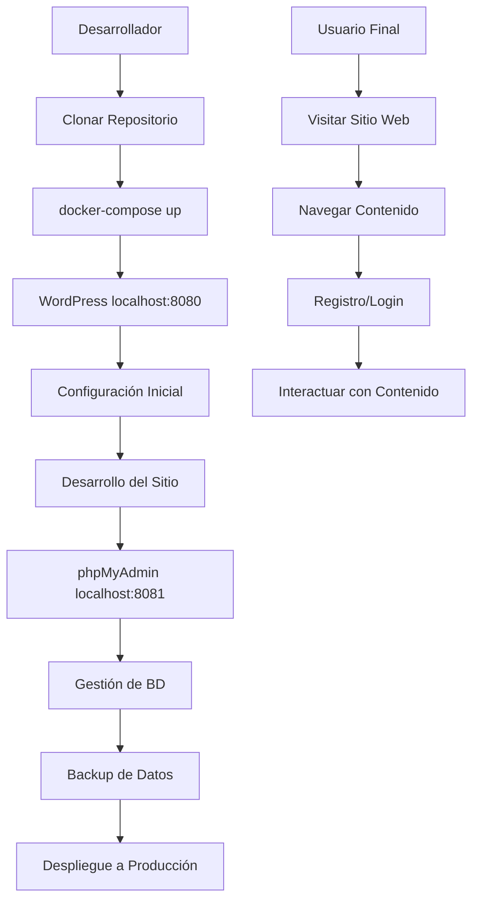

# Requerimientos del Producto: WordPress con Docker Compose

## 1. Descripción General del Producto

Solución completa de WordPress containerizada usando Docker Compose que incluye WordPress, MySQL y phpMyAdmin para desarrollo y producción. El sistema proporciona un ambiente aislado, reproducible y fácil de desplegar que permite desarrollar sitios web WordPress de manera eficiente.

Esta solución resuelve los problemas de configuración manual de servidores, dependencias conflictivas y diferencias entre ambientes de desarrollo y producción.

## 2. Características Principales

### 2.1 Roles de Usuario

| Rol | Método de Registro | Permisos Principales |
|-----|-------------------|---------------------|
| Administrador | Instalación inicial de WordPress | Acceso completo al panel wp-admin, gestión de usuarios, plugins y temas |
| Editor | Invitación por administrador | Crear, editar y publicar posts y páginas |
| Autor | Registro público o invitación | Crear y editar sus propios posts |
| Suscriptor | Registro público | Leer contenido y comentar |
| Desarrollador | Acceso directo a contenedores | Acceso SSH a contenedores, phpMyAdmin, logs del sistema |

### 2.2 Módulos de Funcionalidad

Nuestra solución WordPress con Docker incluye las siguientes páginas principales:

1. **Panel de Administración WordPress**: gestión de contenido, usuarios, plugins, temas y configuraciones del sitio.
2. **Sitio Web Público**: páginas de inicio, posts, páginas estáticas, formularios de contacto y comentarios.
3. **phpMyAdmin**: administración de base de datos, consultas SQL, importación/exportación de datos.
4. **Panel de Monitoreo**: logs de contenedores, métricas de rendimiento, estado de servicios.

### 2.3 Detalles de Páginas

| Nombre de Página | Nombre del Módulo | Descripción de Funcionalidad |
|------------------|-------------------|-----------------------------|
| Panel WordPress | Administración | Gestionar posts, páginas, medios, usuarios. Instalar plugins y temas. Configurar SEO y seguridad |
| Sitio Público | Frontend | Mostrar contenido público, navegación, búsqueda. Formularios de contacto y comentarios |
| phpMyAdmin | Base de Datos | Ejecutar consultas SQL, gestionar tablas. Importar/exportar datos, optimizar rendimiento |
| Logs Docker | Monitoreo | Visualizar logs de contenedores, métricas de CPU/memoria. Reiniciar servicios, backup automático |

## 3. Proceso Principal

**Flujo de Desarrollo:**
1. El desarrollador clona el repositorio y ejecuta `docker-compose up -d`
2. Accede a WordPress en localhost:8080 para configuración inicial
3. Desarrolla el sitio usando el panel de administración
4. Usa phpMyAdmin en localhost:8081 para gestión de base de datos
5. Realiza backup de datos usando volúmenes Docker
6. Despliega a producción usando el mismo docker-compose.yml

**Flujo de Usuario Final:**
1. Visita el sitio web público
2. Navega por contenido, busca información
3. Se registra como usuario si es necesario
4. Comenta en posts o contacta via formularios

## 4. Diseño de Interfaz de Usuario

### 4.1 Estilo de Diseño

- **Colores Primarios**: #0073aa (azul WordPress), #00a0d2 (azul claro)
- **Colores Secundarios**: #ffffff (blanco), #f1f1f1 (gris claro), #23282d (gris oscuro)
- **Estilo de Botones**: Redondeados con radio de 3px, sombra sutil
- **Fuentes**: -apple-system, BlinkMacSystemFont, "Segoe UI", Roboto, sans-serif
- **Tamaños de Fuente**: 14px base, 16px para contenido, 24px+ para títulos
- **Estilo de Layout**: Basado en grid responsivo, navegación superior fija
- **Iconos**: Dashicons (iconos nativos de WordPress), Font Awesome para complementos

### 4.2 Resumen de Diseño de Páginas

| Nombre de Página | Nombre del Módulo | Elementos de UI |
|------------------|-------------------|----------------|
| Panel WordPress | Dashboard | Sidebar izquierdo con menú, área principal con widgets. Colores: #23282d sidebar, #f1f1f1 fondo. Tipografía: 14px Roboto |
| Sitio Público | Tema Frontend | Header con logo y menú, contenido central, sidebar derecho, footer. Responsive design, breakpoints: 768px, 1024px |
| phpMyAdmin | Administración DB | Interface tabular con navegación superior. Colores: #465158 header, #ffffff contenido. Monospace font para código SQL |
| Logs Docker | Monitoreo | Terminal-style con fondo negro #000000, texto verde #00ff00. Fuente monospace, scroll automático, filtros por servicio |

### 4.3 Responsividad

El producto está diseñado mobile-first con adaptación completa para desktop. Incluye optimización táctil para tablets y móviles, con menús colapsables y botones de tamaño adecuado para touch (mínimo 44px). Los breakpoints principales son 480px (móvil), 768px (tablet) y 1024px (desktop).